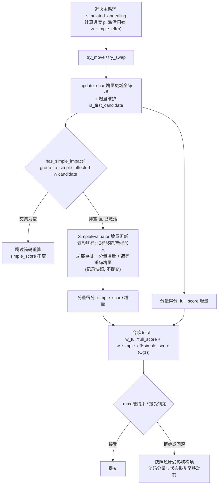

# 设计文档

## Overview

（概述）


本特性的目标是：在不改变（或不显著降低）优化质量的前提下，大幅提升 `weights.simple_code.enabled = true` 时模拟退火的单步速度。

当前性能瓶颈集中在简码评估的全量重建路径：每次「简码相关」的移动都会调用 `Evaluator::rebuild_simple` → `SimpleEvaluator::full_rebuild`，对每个简码级别用 `HashMap` 遍历全部汉字重建桶（`build_level`），再全量扫描整个编码空间计算简码重码（`compute_simple_collisions`）。叠加「拒绝/回滚二次重建」「`group_to_simple_affected` 几乎总非空」「预热阶段反复重建」三大放大因素，单步成本从 O(组内字数) 暴涨到 O(简码级数 × 全部汉字数 + code_space)。

本设计的改造点严格限定在四处，遵循需求 19 的最小改动约束：

1. **简码评估器（`SimpleEvaluator`，`src/evaluator.rs`）**：用「按编码空间直接索引的桶向量」替换 `HashMap`，将 `full_rebuild` 热路径替换为「受影响桶增量更新 + 快照回滚」；新增两种分配模式与候选字集合。
2. **主评估器（`Evaluator`，`src/evaluator.rs`）**：在 `update_char` 的桶维护中增量维护 `is_first_candidate`；将得分拆为 `full_score` / `simple_score` 分量缓存，并以可变有效简码权重做 O(1) 合成。
3. **退火主循环（`simulated_annealing`，`src/annealing.rs`）**：插入延迟激活闩锁、权重渐进曲线、周期对账、结束强制全量校验与增强日志。
4. **配置（`src/config.rs` + `config.toml.example` + `moling/config.toml`）**：新增 6 个配置项与默认值、校验告警，并同步到两个 toml。

核心策略是「增量计算为主、全量重建退居校验」：单步只触碰受影响的少量数据；周期性对账与结束校验用全量结果覆盖增量值以消除浮点漂移，保证最终上报指标精确（需求 15）。

## Architecture

（架构总览）

### 改造范围与数据流

热路径（`try_move` / `try_swap`）的目标数据流如下：



### 激活前后的两种状态

- **未激活（`p < simple_start_progress`）**：`simple_score` 恒为 0（需求 10.2），`has_simple_impact` 不触发任何简码计算，退火只评估全码分量。此阶段 `SimpleEvaluator` 不构建（保持 `None`）。
- **激活后（闩锁置位）**：执行一次全量构建初始化增量状态（需求 8.6），此后所有简码相关移动走增量路径；权重按 smoothstep 曲线从 0 渐进到目标权重 W。

### 周期对账与结束校验

主循环每 `M = floor(total_steps × reconcile_interval_ratio)`（且 `M ≥ 1`）步执行一次全量重算，用全量结果覆盖增量维护的全码与简码指标（需求 15.4/15.5）；优化结束时强制再做一次全量重建校验，使最终上报指标为精确值（需求 15.6）。

## Components and Interfaces

（组件与接口）

### 1. OptContext（`src/context.rs`）新增预计算字段

`OptContext::new` 在启用简码时一次性预计算下列静态数据（频率不变 → 全程不变，需求 4.8/7.4）：

- `simple_candidate_chars: Vec<usize>`：**active** 候选集——按 `simple_active_coverage`（默认 0.90）选出的最小字频前缀（退火期每步增量与周期对账只在此集合出简）。
- `simple_output_candidate_chars: Vec<usize>`：**output（full）** 候选集——按 `simple_coverage_ratio`（默认 1.0，`>=1.0` 含零频字）选出，`active ⊆ output`；仅最终上报与 output 文件使用。
- `simple_is_candidate: Vec<bool>`：候选字位图，按 `ci` 直接索引，供 O(1) 判定。
- `simple_actual_coverage: f64` 与候选字数 `simple_candidate_chars.len()`：供「配置确认」日志输出（需求 7.7/16.6）。
- `group_to_simple_affected_candidate: Vec<Vec<usize>>`：`group_to_simple_affected[group]` 与候选字集合求交并裁剪后的结构（需求 7.6）。用 `Vec` 而非 `HashSet` 以便顺序确定、遍历高效。
- `simple_base_saving: Vec<Vec<i64>>`：`simple_base_saving[ci][li] = full_len - simple_len`，其中 `full_len = char_infos[ci].parts.len()`，`simple_len = level_instructions[li]` 的步数（需求 4.5）。编译期（初始化期）常量。
- `simple_level_capacity: Vec<usize>`：每级简码桶向量容量 = `code_base^L`，`L` 取该级各候选规则指令长度的最大值；因 `calc_simple_code` 的取值严格小于 `code_base^len`，按此容量直接索引安全（需求 3.2）。
- `simple_assign_mode: SimpleAssignMode`：枚举 `Frequency | Efficiency`（需求 4.1/4.2）。

接口保持不变：`calc_simple_code`、`get_simple_keys`、`calc_simple_equiv`、`resolve_key` 复用现有实现。`get_simple_keys` 在热路径中改为写入复用缓冲区的内部变体以避免每步堆分配（需求 3.1/3.3），保留现有 `Vec` 版本供非热路径使用。

### 2. SimpleEvaluator（`src/evaluator.rs`）重构接口

```rust
pub struct SimpleEvaluator {
    levels: Vec<SimpleLevelTracker>,
    all_assigned_flags: Vec<bool>,          // 跨级别出简标记（保留）
    simple_collision_count: usize,          // 简码重码数（增量维护）
    simple_collision_freq: u64,             // 简码重码频率（新增, 增量维护重码率分子）
    simple_collision_rate: f64,
    cached_simple_score: f64,
    simple_score_dirty: bool,
    // 复用缓冲区（去堆分配, 需求 3）
    key_buf: Vec<u8>,                       // get_simple_keys 复用
    snapshot: SimpleSnapshot,               // 快照回滚复用缓冲
    // 受影响传播工作集（复用, 避免每步分配）
    dirty_buckets: Vec<(usize, usize)>,     // (level, bucket_code)
    pending_chars: Vec<usize>,              // 级联传播待处理候选字
}
```

新增/保留的公开方法：

- `SimpleEvaluator::new(ctx, assignment, full_code_to_chars)`：全量构建，初始化增量状态（激活时调用，需求 8.6）。
- `full_rebuild(ctx, assignment, full_code_to_chars)`：全量重建，供周期对账与结束校验调用（需求 15.5/15.6）。
- `apply_move_incremental(ctx, affected_candidates, full_code_to_chars) -> SimpleDelta`：**新增热路径核心**。对受影响候选字做增量更新并记录快照，返回简码分量变化但「不提交」语义体现在调用方决定是否 `commit`/`rollback`。
- `commit()`：清空快照，确认本次增量（需求 2.1）。
- `rollback()`：用快照还原受影响桶项、分量聚合与出简标记，使状态恢复至移动前（需求 2.2/2.3/3）。
- `get_simple_score(ctx)` / `get_simple_metrics(ctx)`：保持现有签名与语义。

### 3. Evaluator（`src/evaluator.rs`）接口变更

新增字段：

```rust
pub struct Evaluator {
    // ... 现有字段保持 ...
    is_first_candidate: Vec<bool>,     // 每个汉字是否为其全码桶首选字（需求 5）
    bucket_first: Vec<usize>,          // 每个全码桶当前首选字 ci（usize::MAX 表示空桶）
    // 分量分数缓存（需求 10）
    cached_full_score: f64,
    full_score_dirty: bool,
    // 时变有效简码权重与激活状态（需求 8/9/10）
    pub simple_active: bool,
    pub current_simple_weight: f64,
}
```

方法变更：

- `update_char`：在现有全码桶 swap_remove/插入逻辑之后，**仅当 `simple_active` 为真时**增量维护 `is_first_candidate` 与 `bucket_first`（结合 `rescan_bucket_first`）；`simple_active` 为假时仅维护 `bucket_max_freq`（用 `rescan_bucket_max`），保持全码热路径基线性能（需求 25）。
- `compute_score` / `get_score`：合成公式改为 `weight_full_code * full_score + current_simple_weight * simple_score`，其中未激活时 `current_simple_weight` 与 `simple_score` 均为 0（需求 9.5/10.3）。
- 新增 `activate_simple(ctx, assignment)`：先调用 `rebuild_first_candidates(ctx)` 一次性重建首选字（因激活前不增量维护，需求 25.3），再构建 `SimpleEvaluator` 并置 `simple_active = true`（一次性，需求 8.6）。
- 新增 `rebuild_first_candidates(ctx)`：据当前 `code_to_chars` 全量重算 `is_first_candidate`/`bucket_first`，供激活时调用（需求 25.3/25.4）。
- 新增 `reconcile(ctx, assignment)`：全量重算全码聚合与简码指标并覆盖增量值（需求 15.5）。
- 新增 `apply_simple_for_move(ctx, assignment, groups)`：在 `try_move`/`try_swap` 内替换原 `rebuild_simple` 调用点，走增量 + 快照路径；拒绝/回滚分支改为调用 `simple_eval.rollback()`（需求 2）。
- 新增 `best_total(weight_full, weight_simple_eff)` 辅助：用分量与给定权重 O(1) 合成（需求 11.2/11.3）。

### 4. 退火主循环（`src/annealing.rs`）接口变更

`simulated_annealing` 内新增局部状态与逻辑（不改变函数签名）：

- 激活闩锁 `simple_activated: bool`；进度 `p = step / steps`；激活阈值/渐进时长读取自 `cfg`。
- 权重曲线函数 `w_simple_eff(p)`（smoothstep，见数据模型）。
- 最佳解按分量存储：`best_full_score`、`best_simple_score`；比较时用当前 `w_eff` 重算 `best_total`（需求 11）。
- 周期对账间隔 `M` 与结束校验。
- 增强日志（需求 16）。

### 5. 配置（`src/config.rs`）接口变更

`SimpleCodeWeights` 结构体新增 6 个带 `#[serde(default = ...)]` 的字段（见数据模型「配置项」）。新增 `SimpleAssignMode` 解析与校验函数 `validate_simple_activation()`（钳制与告警，需求 13）。

## Data Models

（数据模型）

### SimpleLevelTracker（增量化重构）

```rust
struct SimpleBucket {
    members: Vec<usize>,   // 映射到该简码编码的候选字 ci 列表（局部排序对象）
    freq_sum: u64,         // 桶频率和（需求 1.2）
}

struct SimpleLevelTracker {
    code_num: usize,                       // 该级配置的「每有效简码字数上限」（即 SimpleCodeLevel.code_num，非每桶名额）
    capacity: usize,                       // = ctx.simple_level_capacity[li]（桶向量容量 = code_base^L）
    buckets: Vec<SimpleBucket>,            // 按简码编码直接索引（替代 HashMap, 需求 3.2）
    current_simple_code: Vec<i64>,         // current_simple_code[ci]: 该字当前简码编码, -1 表示无（需求 1.2）
    selected: Vec<bool>,                   // 该级出简标记（需求 1.2/1.4）
    // 增量维护的级别聚合
    covered_freq: u64,
    equiv_weighted: f64,
    equiv_freq_sum: u64,
    key_usage: [f64; EQUIV_TABLE_SIZE],
    key_presses: f64,
}
```

说明：

- `buckets` 按编码空间直接索引，`buckets[code]` 即一个简码桶；`current_simple_code[ci]` 缓存候选字当前所在桶编码，用于 O(1) 定位旧桶（需求 1.2）。
- 级别聚合（`covered_freq` 等）随选中集合变化做增量加减，不再每次从桶重算（需求 1.4）。
- `current_simple_code` 与 `selected` 仅对候选字有意义；非候选字不参与（需求 4.8/7.5）。

### 分配模式与排序键

```rust
#[derive(Clone, Copy, PartialEq)]
pub enum SimpleAssignMode { Frequency, Efficiency }
```

排序键计算（用于桶内选出前 `N` 个出简候选，`N` = 该桶退火可出简名额 = `Σ_{有效上屏键} max(0, code_num − occ)`，见需求 21.7）：

- **Frequency 模式**（需求 4.3）：`key(ci) = freq(ci)`。该模式与旧实现的「按字频降序 take(code_num)」语义完全一致（旧 `build_level` 按 `sorted_chars` 字频降序插入并 `take`，并列按 `ci` 升序），因此满足需求 17.5 的「与旧实现一致」。
- **Efficiency 模式**（需求 4.4，默认）：`key(ci) = freq(ci) × (base_saving[ci][li] + sel_len(ci))`，其中 `base_saving = full_len - simple_len`（预计算常量，需求 4.5），`sel_len ∈ {0, 1}` 由 `is_first_candidate` 决定（需求 4.6/5.4）。

并列裁决（两种模式统一，需求 4.7）：排序键相等时先按 `freq` 降序、再按 `ci` 升序，保证结果可复现。桶内排序仅在受影响桶上局部进行，不维护跨桶全局有序结构（需求 6.1/6.2/6.3）。

```text
fn cmp_in_bucket(a, b):
    ka, kb = key(a), key(b)
    if ka != kb: return kb.cmp(ka)            # 排序键降序
    if freq(a) != freq(b): return freq(b).cmp(freq(a))   # 先按 freq
    return a.cmp(b)                            # 再按 ci 升序
```

`sel_len` 取值：`is_first_candidate[ci] == true → sel_len = 0`（首选字），否则 `sel_len = 1`（非首选字），且不考虑候选翻页（需求 4.6）。

### is_first_candidate 的增量维护（主评估器）

定义：`is_first_candidate[ci]` 表示 `ci` 是否为其全码桶 `code_to_chars[code]` 中的首选字。首选字取桶内「最大频率」者，并列取最小 `ci`，保证确定性（与 `bucket_max_freq` 语义对齐，仅依赖全码桶、与简码分配无关，需求 5.1/5.2）。

**维护门控（需求 25，性能关键）**：首选字 `is_first_candidate`/`bucket_first` 仅在 `simple_active == true` 时增量维护；简码关闭或延迟激活前（`simple_active == false`）`update_char` **完全跳过**这部分维护——因为此阶段没有任何读者读取首选标记（`has_simple_impact` 在 `!simple_active` 时短路返回 false，`sel_len` 不被计算）。这样简码关闭时全码热路径与基线版本 `27fcc6d` 逐字节等价，不引入任何回归。

在 `update_char` 现有桶维护点，**当 `simple_active` 为真时**增量更新（需求 5.3/25.1）：

```text
# 从 old_code 桶移除 ci 之后：
if bucket_first[old_code] == ci:
    重扫 old_code 桶求 (max_freq, 最小 ci) → 新 first       # rescan_bucket_first
    翻转受影响字的 is_first_candidate（旧 first=ci 置 false, 新 first 置 true）
# 向 new_code 桶加入 ci 之后：
if new_code 桶为空之前 or freq(ci) > bucket_max_freq(new_code)
   or (freq(ci) == max 且 ci < bucket_first[new_code]):
    旧 first 置 false; bucket_first[new_code] = ci; is_first_candidate[ci] = true
else:
    is_first_candidate[ci] = false
```

**当 `simple_active` 为假时**，`update_char` 仅维护 `bucket_max_freq`：移除分支用仅求最大频率的 `rescan_bucket_max`（不跟踪首选字，需求 25.2），插入分支只在 `freq > bucket_max_freq` 时更新最大频率，与基线行为一致。

**激活时一次性重建（需求 25.3/25.4）**：由于激活前不增量维护首选字，`activate_simple` 在置 `simple_active = true` 并构建 `SimpleEvaluator` **之前**，调用 `rebuild_first_candidates(ctx)` 据当前 `code_to_chars` 一次性全量重算 `is_first_candidate`/`bucket_first`（开销 O(字数)，约一万余次，远小于激活前在每步移动里反复增量维护的累计开销）。该重建必须先于 `SimpleEvaluator::new`（其构造读取 `is_first_candidate`）。因激活前无人读取首选标记，「激活前不维护 + 激活时重建」与「全程增量维护」在激活时刻的状态完全一致（正确性保证）。

激活后，重扫只在「移除的恰是首选字」时发生，与 `bucket_max_freq` 重扫时机一致，合并为一次 `rescan_bucket_first` 返回 `(max_freq, first_ci)`，不引入额外全量扫描。

**resort 种子只登记候选字（性能优化）**：`simple_is_first_dirty` 仅被 `apply_simple_for_move` 用作 resort 种子，而种子只对候选字（`ctx.simple_is_candidate[ci]`）有意义。因此 `update_char` 的三处首选翻转登记加 `if ctx.simple_is_candidate[...]` 守卫，只 push 候选字——避免非候选字白白堆入缓冲、增大每次 `apply_simple_for_move` 的种子扫描。该改动与「push 全部、apply 时过滤候选」行为等价（apply 内本就有候选过滤），纯性能优化。

### 简码增量更新算法（核心）

当退火移动组 `r` 且 `has_simple_impact(r)` 为真且简码已激活时，对受影响候选字集合 `A = group_to_simple_affected_candidate[r]` 执行：

```text
fn apply_move_incremental(ctx, A, full_code_to_chars):
    snapshot.begin()                      # 记录将被触碰的桶项与聚合, 复用缓冲
    dirty_buckets.clear(); pending.clear()

    # 阶段 1：对每个受影响候选字, 在各级别做"旧桶移除/新桶加入"
    for ci in A:
        for li in 0..n_levels:
            new_code = ctx.calc_simple_code(ci, li, assignment)   # 可能为 None
            old_code = levels[li].current_simple_code[ci]
            if new_code == old_code: continue
            snapshot.record_char(li, ci)
            从 old_code 桶移除 ci, freq_sum -= freq；标记 (li, old_code) dirty
            向 new_code 桶加入 ci, freq_sum += freq；标记 (li, new_code) dirty
            current_simple_code[ci] = new_code

    # 阶段 2：按级别顺序处理 dirty 桶, 重算选中集合并级联跨级出简
    for li in 0..n_levels (升序, 保证跨级排除顺序与全量一致):
        for (level, code) in dirty_buckets where level == li:
            snapshot.record_bucket(li, code)
            局部排序 buckets[code].members（cmp_in_bucket, 排除已被前序级别出简的字）
            new_selected = 前 N 个未被排除者（N = 该桶退火可出简名额，见需求 21.7；含异手过滤与每上屏键占用扣减）
            对比 old_selected 与 new_selected:
                对"取消选中"的字: 级别聚合扣除其 covered/equiv/dist 贡献;
                                  all_assigned_flags 可能清除; 该字在 li+1 级变为可选 → 加入 pending
                对"新增选中"的字: 级别聚合加上其贡献;
                                  all_assigned_flags 置位; 该字在 li+1 级被排除 → 加入 pending
        # 将 pending 中受跨级排除影响的字, 在其 li+1 级所属桶标记 dirty 后清空 pending

    # 阶段 3：简码重码增量（需求 14）
    F = { old_full_code(ci), new_full_code(ci) : ci ∈ 本次移动的 group_to_chars[r] }
        ∪ { full_code(ci) : ci 的 all_assigned_flags 在本次发生翻转 }
    for code in F:
        snapshot.record_collision_bucket(code)
        用当前 full_code_to_chars[code] 去除 all_assigned_flags 为真的字, 重算该桶 (n-1) 与 (sum-max)
        以差量更新 simple_collision_count 与 simple_collision_freq
    simple_collision_rate = simple_collision_freq / total_frequency
    simple_score_dirty = true
```

要点：

- **受影响裁剪**（需求 1.3/7.6）：只遍历 `A`（已与候选集求交），交集为空时直接返回、`simple_score` 不变（需求 1.5）。
- **局部重排**（需求 6）：只对 dirty 桶内的短候选列表排序，不维护全局有序结构。
- **跨级出简一致性**：阶段 2 按级别升序处理并通过 `pending` 传播跨级排除，复刻全量 `full_rebuild` 中「低级别先出简、高级别排除已出简字」的语义，确保增量结果与全量一致（需求 15.1）。
- **简码重码两个来源**（需求 14）：阶段 3 的 `F` 同时包含「全码桶成员变化」（移动组的字改变全码）与「出简集变化」（`all_assigned_flags` 翻转）两个来源；仅在这些少数全码桶上增量更新，不全量扫描 `code_space`（需求 14.3）。全码重码（`total_collisions` / `collision_frequency`）由主评估器独立维护，不受出简影响（需求 14.1）。

### 快照与回滚（取消二次重建）

快照粒度（复用预分配缓冲，需求 3.1）：

```rust
struct SimpleSnapshot {
    // 触碰的桶项：保存修改前的桶成员与 freq_sum
    buckets: Vec<(usize /*li*/, usize /*code*/, Vec<usize> /*old members*/, u64 /*old freq_sum*/)>,
    // 触碰的 current_simple_code / selected / all_assigned 条目
    char_codes: Vec<(usize /*li*/, usize /*ci*/, i64 /*old code*/, bool /*old selected*/)>,
    assigned: Vec<(usize /*ci*/, bool /*old flag*/)>,
    // 级别聚合标量与简码重码标量（整存整取, 数量少）
    level_aggregates: Vec<LevelAggregateSnapshot>,
    old_collision_count: usize,
    old_collision_freq: u64,
    old_cached_simple_score: f64,
}
```

流程（需求 2/3）：

1. **算 delta 不提交**：`apply_move_incremental` 在修改前对每个被触碰的桶/条目/聚合写入快照，再就地修改。
2. **接受则提交**：`commit()` 清空快照缓冲（O(触碰数)），无需重算。
3. **拒绝/回滚则还原**：`rollback()` 逆序把快照中的桶成员、`freq_sum`、`current_simple_code`、`selected`、`all_assigned_flags`、级别聚合标量、简码重码标量与 `cached_simple_score` 写回，使简码分数与受影响桶状态恢复到移动前（需求 2.3/3）。回滚成本为 O(受影响桶项数)，不触发任何全量重建（需求 2.2）。

`try_move` / `try_swap` 的回滚分支（含 `_max` 硬约束回滚）一律改为：先回滚全码（沿用现有 `update_char` 反向重放），再调用 `simple_eval.rollback()`，替换原先的 `rebuild_simple` 二次全量重建。

### 分量分数缓存与综合得分（需求 10/11）

- 主评估器分别缓存 `full_score`（由 `compute_full_score` 从全码聚合增量得到）与 `simple_score`（`SimpleEvaluator.cached_simple_score`）。
- 综合得分 O(1) 合成：`total = weight_full_code * full_score + current_simple_weight * simple_score`。
- 未激活时 `current_simple_weight = 0` 且 `simple_score = 0`，故综合得分等于纯全码（需求 10.2）。
- 最佳解按分量存储 `best_full_score` / `best_simple_score`；每次比较用当前 `w_simple_eff` 重算 `best_total = weight_full_code * best_full_score + w_simple_eff * best_simple_score`（O(1)，需求 11.2/11.3），解决目标函数随时间漂移导致最佳解被冻结的问题。

### 延迟激活与权重渐进曲线（需求 8/9/12）

```text
p = step / total_steps
p_start = simple_start_progress        # 默认 0.4
p_ramp  = simple_ramp_progress         # 默认 0.1
W = weight_simple_code                 # 目标简码权重

# 激活（闩锁, 需求 8.3/8.4）
if (not simple_activated) and (p >= p_start or hard_activate):
    evaluator.activate_simple(ctx, assignment)   # 一次全量构建（需求 8.6）
    temp_multiplier *= simple_activation_reheat   # 独立升温（需求 12, 默认 1.2）
    simple_activated = true

# 有效权重曲线（smoothstep, 需求 9）
fn w_simple_eff(p):
    if p < p_start: return 0.0
    if p < p_start + p_ramp:
        α = (p - p_start) / p_ramp
        s = α*α*(3 - 2*α)
        return W * s
    return W

# 硬激活兼容档（需求 13.5）：p_start == 0 且 p_ramp == 0 → 从第 0 步即激活, w 恒为 W
```

主循环插入点与对缓存机制的最小改造：

```text
for step in 0..steps:
    p = step / steps
    [激活判定与升温]
    w = w_simple_eff(p)
    if w != evaluator.current_simple_weight:
        evaluator.current_simple_weight = w
        evaluator.score_dirty = true        # 权重变化使 cached_score 失效, 下次 get_score 以新权重重算
    [温度计算 / 邻域分发 / try_move|try_swap]   # 内部 old_score 与 new_score 同权重, delta 自洽
    [best 比较: 用 w 重算 best_total]
    [每 M 步: evaluator.reconcile(ctx, assignment)]
# 结束: evaluator.reconcile(ctx, assignment) 强制全量校验
```

对 `score_dirty` / `cached_score` 的改造最小化：仅在「有效权重发生变化的步」额外置 `score_dirty = true`；单步移动内部权重恒定，`get_score` 缓存语义不变。

### 渐进 vs 一步到位：接受概率与分数语义分析

退火接受准则（`try_move`/`try_swap`）：综合得分 `score = weight_full · full + w_eff(p) · simple`；单步 `delta = score_new − score_old`；`delta ≤ 0` 必接受，否则以 `P = exp(−delta / temp)` 接受。

**关键拆解（单步内 `w_eff` 恒定）**：
```
delta = weight_full · Δfull + w_eff · Δsimple
```
其中 `Δfull/Δsimple` 为该移动引起的全码/简码分量变化。由此得出两条不变结论：

1. **绝对分数台阶不影响接受**：激活时综合得分整体抬升（`w_eff·simple` 项从 0 变为 `W·simple`），但对「不改简码」的移动该抬升同时进入 `score_old` 与 `score_new`，在 `delta` 中抵消。接受只取决于 `delta`，故分数绝对值跳变本身**不改变任何接受概率**；渐进期 🏆最优 数值上升是**称重变重的产物，不代表解变差**，且最优解按分量存储、每步用当前 `w_eff` 重算 `best_total`（需求 11），比较始终自洽——这不是退火"方向相反"的回归。
2. **`w_eff` 只调节含简码变化的移动**：`Δsimple = 0` 的纯全码移动其 `delta` 与 `w_eff` 无关，两种做法完全一致。

**`w_eff` 对各类移动接受概率的方向性影响**：

| 移动类型 | Δfull | Δsimple | `w_eff↑` 时 P |
|---|---|---|---|
| 纯全码 | 任意 | 0 | 不变 |
| 简码改良/全码变差 | >0 | <0 | 升高（更易接受） |
| 简码变差/全码改良 | <0 | >0 | 降低（保护简码） |
| 双改良 | <0 | <0 | 恒接受 |
| 双变差 | >0 | >0 | 降低 |

即 `w_eff` 越大，优化器越倾向"用全码换简码"、越抗拒"用简码换全码"。

**两种做法的差异（温度完全相同，仅 `w_eff(p)` 曲线不同）**：
- **渐进（`p_ramp>0`）**：激活窗口内 `w_eff` 由 0 平滑升到 W。简码取舍激励逐步介入；目标函数在窗口内**非平稳**，优化器追"移动目标"，低 `w_eff` 期优化到的解会被随后升高的 `w_eff` 部分作废。初衷是缓解"首刻满权重简码项"的重排冲击/抖动（需求 9）。
- **一步到位（`p_ramp=0`）**：`p ≥ p_start` 即 `w_eff=W`。简码立即全速参与取舍，激活后目标随即平稳、单调下降，配合需求 26 的激活时一次性重定价，分数在激活点一次设定好、之后只降不升，更符合退火直觉。

**量级结论（以 p_start=0.4 为例）**：激活温度 `temp ≈ 6.5e-4`（含 reheat ×1.2 首步约 7.8e-4），而单步 `Δfull/Δsimple` 量级约 1e-3~1e-4。对一个让综合上升 `delta≈1e-3` 的爬坡move，`P=exp(−1e-3/6.5e-4)≈0.21`；`delta≈5e-4` 时 `P≈0.46`。说明在 p=0.4（温度仍较高）处，即便一步到位上满 `W`，中等爬坡接受概率仍有 0.2~0.5，**不会冻结**；故渐进的缓冲价值有限。对照：若在冷尾段 p=0.6（temp 3.85e-4）一步到位，同样 `delta=1e-3` 的 `P≈0.074`，接受率显著更低——那种情形渐进的缓冲才更有价值。

**实现现状与可配置性**：`w_simple_eff` 在 `p_ramp==0` 时对 `p≥p_start` 直接返回 `W`，故**一步到位无需改代码**：将 `simple_ramp_progress` 设为 `0.0`（保持 `simple_start_progress=0.4`，不触发 (0,0) 硬激活兼容档）即可。建议以"渐进（ramp=0.1）"为基线、"一步到位（ramp=0）"为对照做 A/B，比较最终综合得分与简码子指标（覆盖率/当量/分布）后再决定是否调整默认 `simple_ramp_progress`。

### 配置项（需求 17/18）

`SimpleCodeWeights` 新增字段（`src/config.rs`，含 serde 默认值函数）：

| 配置项 | 类型 | 默认值 | 含义 |
| --- | --- | --- | --- |
| `simple_start_progress` | f64 | 0.4 | 简码计算激活进度阈值 |
| `simple_ramp_progress` | f64 | 0.1 | 权重从 0 渐进到 W 的进度长度 |
| `simple_activation_reheat` | f64 | 1.2 | 激活当刻升温倍率（独立于 reheat_factor；合理范围 `[1.0, temp_start/base_temp(p_start)]` 动态校验） |
| `simple_coverage_ratio` | f64 | 1.0 | 候选字累计字频覆盖率阈值（输出全集 output 范围） |
| `simple_active_coverage` | f64 | 0.90 | 退火期 active 候选覆盖率（须 ≤ simple_coverage_ratio）；passive 候选仅最终上报/输出纳入 |
| `reconcile_interval_ratio` | f64 | 0.05 | 周期对账间隔比例，`M = floor(total_steps × ratio)`，`M ≥ 1` |
| `simple_assign_mode` | String | "efficiency" | 桶内出简排序模式："frequency" 或 "efficiency" |

校验（`validate_simple_activation`，需求 13）：

```text
if simple_start_progress < 0: warn; simple_start_progress = 0
if simple_ramp_progress  < 0: warn; simple_ramp_progress  = 0
if simple_start_progress >= 1: warn; simple_start_progress = clamp 到 [0,1) 内最大有效值
if simple_start_progress + simple_ramp_progress > 1:
    warn; simple_ramp_progress = (1 - simple_start_progress)   # 钳定
if simple_start_progress == 0 且 simple_ramp_progress == 0:
    hard_activate = true   # 从开始即硬激活（兼容档）
simple_assign_mode 非法字符串 → 采用默认 "efficiency"
```

两个 toml（`config.toml.example`、`moling/config.toml`）在 `[weights.simple_code]` 段同步新增上述 6 项，附注释说明与默认值，且默认值与代码内置一致（需求 18）。

### 空格上屏与固定简码（需求 20/21）

本节为后续追加的两个功能特性的设计，沿用「静态预计算 + 增量热路径不变」的总体策略：两者引入的量都在 `OptContext::new`（退火前）一次性确定，热路径与回滚逻辑无需改动。

#### 上屏键序列（需求 20/36，取代旧 `space_commit` 布尔）

- **配置与类型**：`SimpleLevelConfig`（`src/config.rs`，TOML `[[simple_levels]]`）新增字符串字段 `commit_keys: String`，`#[serde(default)]` 缺省 `""`；内部 `SimpleCodeLevel`（`src/types.rs`）持有解析后的 `commit_keys: Vec<u8>`（字母→键索引、`_`→`KEY_SPACE`）及两张预计算偏好表 `commit_pref_last_left: Vec<u8>` / `commit_pref_last_right: Vec<u8>`。**废弃兼容**：保留可选 `space_commit: Option<bool>`；仅当 `commit_keys` 缺省时，`Some(true)→"_"`、`Some(false)→""` 并打废弃告警；两者同时给出则以 `commit_keys` 为准并告警。
- **K 与有效码长**：`K = |左手字母| + |右手字母| + (含 _ ? 1 : 0)`。`commit_keys` 非空时该级每个出简字有效码长 = 核心码长 + 1（与具体上屏键无关）；空时 = 核心码长。故 `simple_base_saving[ci][li] = full_len - (核心码长 + (commit_keys 空 ? 0 : 1))`，仍是与名次/分配无关的预计算常量。资格 `simple_eligible` 只看核心码长（需求 22，不含上屏键）。
- **偏好表预计算（需求 36，性能关键）**：偏好表只取决于「核心末键手别」，故每级仅两张、退火前一次性构建，长度 K，极小。构成：先「对侧手字母子序列」再「同侧手字母子序列」（各自保 `commit_keys` 原序），`_` 按其在 `commit_keys` 的首/尾位置加在表首/表尾。`_` 只允许在 `commit_keys` 首或尾（否则配置报错）。手别由静态表 `key_hand(key)` 按 QWERTY 物理布局给出（左：`qwert asdfg zxcvb`，右：`yuiop hjkl; nm,./`，`_` 中性）。
- **桶内出简名额与上屏键分配（需求 21.7/36.4，方案 A）**：每个**有效简码**至多 `code_num` 个全码字——有效简码 = 核心简码（`commit_keys` 空）或「核心简码 + 某个上屏键」（`commit_keys` 非空，每个上屏键一个独立有效简码）。故核心桶的退火可出简名额 `N = Σ_{有效上屏键 k} max(0, code_num − occ_k)`（`commit_keys` 空时即 `max(0, code_num − occ)`），由 `ctx.simple_annealing_slots(li, code)` 计算（无上屏键 O(1)；有上屏键沿偏好表 O(K) 累加，与既有 K′=0 检查同阶）。桶核心末键经 `last_key = code % code_base - 1` O(1) 还原选偏好表；名次 i 的退火出简字按「轮次轮转」取上屏键：每个上屏键 `k` 至多被退火占用 `cap_k = max(0, code_num − occ_k)` 次，第 0 轮按偏好表序给所有 `cap_k>0` 的键各一次、第 1 轮给 `cap_k>1` 的键……由 `commit_key_for_rank(li, code, i)` 在偏好表上 O(code_num·K) 完成、零堆分配。`code_num=1` 且无占用时退化为 `i mod K′`（与历史轮转一致）。
- **异手过滤（需求 37）**：`SimpleCodeLevel` 增 `commit_alt_hand_only: bool`（缺省 false）。为真时，`simple_annealing_slots` 与 `commit_key_for_rank` 在沿偏好表累加/分配时**额外跳过与核心末键同手的字母上屏键**（`key_hand(k) == 核心末键手别 且 k != KEY_SPACE`），保留异手字母与 `_`（`_` 中性、始终保留）——即这些被过滤的上屏键不构成有效简码、不计入名额。过滤后若无任何有效上屏键（异手字母全无且无 `_`）则该桶名额为 0、不出简（候选字上浮）。过滤在偏好表顺序遍历时 O(K) 完成，不新增预计算、不堆分配。固定简码不受此过滤影响（字面预分配，同手亦保留并输出）。核心末键手别由 `code` O(1) 还原。
- **当量/分布/输出按实际上屏键**：`calc_simple_equiv` 与 `fill_keys_with_commit` 增参 `commit_key: Option<u8>`：`Some(c)` 时末位核心键到 `c` 计入转移当量、`c` 计入 `key_usage`/`key_presses`，输出在核心串后追加 `key_to_char(c)`（空格为 `_`）。`reselect_bucket` 在按名次 `idx` 遍历成员时传入该名次对应的上屏键。**回滚无需新增字段**：每字的 `sel_equiv`/`sel_keys`/`sel_keys_len` 已被 `ContribUndo` 快照，名次变化导致的上屏键变化由既有快照机制还原。
- **行为等价（回归保证）**：`commit_keys==""` ↔ 旧 `space_commit=false`（无上屏键，核心桶名额 = `max(0, code_num − occ)`）；`commit_keys=="_"` ↔ 旧 `space_commit=true`（K=1、两手偏好表均 `[KEY_SPACE]`、名次都取空格，`code_num>1` 时同一有效简码 `…_` 上多字重码靠选重区分）。`commit_keys` 非空且 `code_num=1`、无固定占用时，核心桶名额 = K（每个上屏键各 1 字），与历史「桶名额扩到 K」结果逐字段一致——本次修订仅在 `code_num≥2` 或存在固定占用时改变行为（恢复「每有效简码 `code_num` 字」原义）。
- **不变量**：上屏键不进入 `calc_simple_code` 桶编码与 `simple_level_capacity`（桶仍按核心简码键位编码索引）。

#### 固定简码（需求 21）

- **配置（内联 config.toml）**：在 `Config`（`src/config.rs`）新增顶层可选字段 `fixed_simple_codes: Option<BTreeMap<String, String>>`，对应 TOML 顶层内联表 `[fixed_simple_codes]`（形如 `"不" = "u"`、`"了" = "a_"`）。用 `BTreeMap` 保证遍历顺序确定。解析为 `Vec<(char, String)>`（键取首个 `char`）。两个 toml 提供默认注释掉的示例（需求 21.11）。
- **级别归属与校验**（需求 21.5/21.6/22.3）：对每条固定简码（总长 T），按两种解释归级——「纯核心」：某级 `commit_keys` 为空且核心键位数==T → 占普通名额；「核心+上屏」：某级 `commit_keys` 非空、核心键位数==T−1、且 FC 末键 ∈ 该级 `commit_keys` → 占该核心桶里「FC 末键」对应的 commit slot。多级命中取级别号最小并告警。**无归属（需求 21.6）**：两种解释都不命中（如一码固定简码但所有一键级别都带 `commit_keys`）时，仅告警、`FixedSimpleCode.li = None`，**不丢弃**——仍 `simple_fixed_assigned[ci]=true`、计常量贡献、`all_assigned_flags` 恒真、output 照常输出，但不占任何 commit slot。核心码经与 `calc_simple_code` 一致编码为桶编码；有效长度（含末键）须 < 全码长度，否则告警拒绝。
- **`FixedSimpleCode` 结构变更**：`li: usize` → `li: Option<usize>`。生产代码仅 `output.rs` 两处输出点读 `fc.li`（改 `== Some(li)` 并加无归属收尾段）；`evaluator.rs` 设 `all_assigned_flags` 处只用 `fc.ci`，对 `None` 天然正确。
- **`OptContext` 预计算新增字段**（仅启用简码时填充，退火前一次性确定，全程不变）：
  - `simple_fixed_assigned: Vec<bool>`：按 `ci` 索引，标记该字是否为固定简码字。
  - `simple_fixed_occupancy: Vec<FxHashMap<u32, Vec<(u8, u32)>>>`：稀疏占用计数表，`simple_fixed_occupancy[li]` 映射 `核心桶编码 → 该桶各被占用「上屏键」的占用计数` `(key, count)` 列表。有上屏键级别按实际上屏键索引；无上屏键级别用哨兵键 `255`（非法键索引）记核心简码自身的占用计数。采用**计数**（取代旧 bitmask）以支持「同一有效简码上 ≥2 个固定字」（方案 A）。仅在确有固定简码时按级分配空映射，否则外层空 `Vec`；访问器（`simple_fixed_occ_total` / `simple_fixed_occ_key`）对空/缺失回退 0。改稀疏后还省去高级别 `code_base^L` 密集占用表的分配。
  - 固定简码常量贡献：`fixed_covered_freq` / `fixed_equiv_weighted` / `fixed_equiv_freq_sum` / `fixed_key_usage[..]` / `fixed_key_presses`（含其末键上屏键，需求 21.8/21.9）。
- **候选字解耦**（需求 21.3/21.4）：候选集按 `simple_coverage_ratio`/`simple_active_coverage` 在全集选取后，剔除 `simple_fixed_assigned` 为真的字（无论是否归级）。
- **出简语义**（需求 21.8）：固定简码字 `all_assigned_flags[ci]=true` 永不翻转；其覆盖率/当量/分布贡献由常量偏置体现。
- **桶选取与占用**（需求 21.7/36.4，方案 A）：退火桶可出简名额 = `Σ_{有效上屏键 k} max(0, code_num − occ_k)`（无上屏键级别即 `max(0, code_num − occ)`），由 `simple_annealing_slots` 计算；退火字上屏键按「各上屏键剩余容量 `code_num − occ_k`」轮次轮转分配（`commit_key_for_rank`）。占用为常量，热路径与回滚不受影响。
- **`code_num=0` 级别保留**（需求 21.13）：`get_simple_code_config` 保留「有固定简码按规则归属到其上」的 `code_num=0` 级别，丢弃无归属的 `code_num=0` 级别。
- **输出**（需求 21.10）：`src/output.rs` 各级输出归属本级的固定简码，并在所有级别之后单列一段输出 `li==None` 的固定简码，保证两个 output 文件均不遗漏。配置确认日志逐条打印固定简码归属级别（或「无归属」告警）。

#### 简码长度严格短于全码（需求 22）

- **静态资格过滤**：候选字 `ci` 仅当其在级别 `li` 的**核心码长**（指令步数，不含上屏键）严格小于全码长度 `full_len(ci)` 时才允许进入该级简码桶；`full_len = char_infos[ci].parts.len()`。资格判定不计入上屏键，使非空 `commit_keys` 的级别在「全码-核心简码=1」时不被误拒。`base_saving` 与当量/分布统计仍以 `effective_simple_len = 核心码长 + (commit_keys 空 ? 0 : 1)` 计算，反映真实击键成本。该资格为退火前静态预计算（与 `simple_base_saving` 一并计算，使用 `simple_eligible[ci][li]` 位图），全量重建与增量更新两条路径共用同一判定，保证一致（需求 22.4）。
- 在 `rebuild_selection` 与 `apply_move_incremental` 的「候选字入桶」步骤加入该资格判定：不合格的 `(ci, li)` 既不进入桶、也不计 `current_simple_code`，等价于 `calc_simple_code` 返回 `None` 的处理路径。
- 固定简码若违反该约束则在加载期拒绝（需求 22.3）。

#### 输出镜像评估器选择（需求 23）

`src/output.rs` 的简码输出不再独立按字频重新推导，而是直接复用评估器算出的出简选择，保证
输出方案与被优化/上报方案逐字一致：

- 新增 `SimpleEvaluator::selected_ordered(ctx, is_first_candidate)`：返回实际出简的 `(li, ci)`
  列表，按级别升序、同级按简码桶编码升序、桶内按选择排序键 `cmp_in_bucket` 排列（即分配顺序）。
- `output.rs` 新增 `evaluator_simple_selection(ctx, assignment)`：以与 `Evaluator::new` 同口径
  构建 `SimpleEvaluator`（同样的 `is_first_candidate` 取法）并调用 `selected_ordered`；
  `save_simple_code_output` 复用其已构建的 `se`、`save_combined_code_output` 经该辅助构建。
- 两个输出函数按返回的顺序输出优化出简（经 `simple_code_str` 拼接核心键位串并按该字实际上屏键
  追加字符），再输出归属各级的固定简码（保留其字面上屏键），最后单列一段输出无归属固定简码。因选择来自评估器 `selected`，efficiency
  排序键、`sel_len`、固定占用扣减（每有效简码 `code_num − occ`、桶名额 `Σ max(0, code_num − occ)`）、上屏键偏好与跨级排除全部自动一致。

#### warmup 与坐标下降按调用上下文区分简码（需求 24）

`enhanced_hill_climb`（=`hill_climb_warmup`）与 `coordinate_descent` 被**两类上下文**复用，必须区别对待，因此各增一个 `disable_simple: bool` 参数：

**上下文 A — Init / 校准预热（`disable_simple=true`）**

`multi_start_init`（被 Init 与校准用的 `smart_init` 调用）的输出仅为 `Vec<u8>` 分配，其评估器实例用完即弃，简码计算对结果零贡献：

- **Init**：warmup 找到的 best_assignment 被 SA 主循环用 `Evaluator::new` 重建并从 `simple_active=false` 开始延迟激活；
- **校准**：warmup 产出的初始分配，由校准段 `initial_eval = Evaluator::new(temp_ctx, initial_assignment)` 重建时急切构建的 `SimpleEvaluator` 提供**唯一一次**全量简码观测（ScaleConfig 观测来源）。

故 `disable_simple=true` 时改用 `Evaluator::new_full_only`（`build_simple=false`），**直接跳过急切 `SimpleEvaluator` 构建**：`simple_eval = None` ⟹ `simple_active=false` / `current_simple_weight=0.0`，`has_simple_impact` 恒为 `false`，`coordinate_descent` 的 probe-then-revert 循环不进入简码分支（消除旧实现每次探测两次的全量重建），`try_move`/`try_swap`/`try_triple_swap` 的简码增量也短路。分配决策退化为纯全码，与 SA 主循环 `p < p_start` 阶段语义一致。

> **关键提速点**：仅事后置 `simple_active=false`（旧做法）并不能省去 `Evaluator::new` 内部的急切 `SimpleEvaluator::new` 全量构建——而 `multi_start_init` 按候选数循环（约 50 次/阶段）外加一次坐标下降，会产生约 `候选数+1` 次**被丢弃**的全量简码构建。`new_full_only` 从构造入口就跳过该构建，使校准/Init 真正做到「全码优化期间零简码构建」。Init 与校准共用 `multi_start_init`，故两者**同时**受益；Init 仅保留 `multi_start_init` 返回后 SA 主循环自身的一次必要 `Evaluator::new`（延迟激活的工作评估器）。

**上下文 B — SA 结尾最终精炼（`disable_simple=false`）**

最终精炼直接作用于 SA 产出的 `best_assignment`，其结果**会被采纳为最终方案**，因此必须连续地以简码维度精炼，不能关掉简码、也不能用全量 `rebuild_simple`：

- 保持 `Evaluator::new` 急切构建的 `SimpleEvaluator` 激活（`simple_active=true`、`current_simple_weight=weight_simple_code`）；
- `coordinate_descent` 的前向探测、回滚、应用最优三处改用**增量**简码：探测用 `apply_simple_for_move(ctx, assignment, &[gi])`（pending，不提交）→ 评分 → 回滚用 `rollback_simple()`；应用最优用 `apply_simple_for_move` + `commit_simple()`，镜像 `try_move` 结构，禁用 `rebuild_simple`；
- `enhanced_hill_climb` 沿用其算子内置的增量简码（`try_move`/`try_swap` 走 `Evaluator` 增量；`try_triple_swap` 走 `apply_simple_for_move` + `commit/rollback`）。

**评分口径一致性（关键正确性）**：`disable_simple=false` 时内部评估器的 `current_simple_weight = weight_simple_code`，使 `get_score` 返回 `weight_full·full + weight_simple·simple`，与 SA 主循环结尾重算的 `best_score`（经 `best_total` 用同一 `w_target` 合成）同口径。于是 `final_score < best_score`、`cd_score < best_score` 的接受判定在简码维度上正确。若误用 `disable_simple=true`（如历史 commit `e16ab24` 的无条件关闭），精炼分数会退化为纯全码分，与含简码的 `best_score` 比较即「拿苹果比橘子」，导致错误接受/拒绝。

**调用点绑定**：`multi_start_init` 内两处传 `true`；`simulated_annealing` 结尾两处传 `false`。

**简码关闭零影响**：所有简码相关分支都在 `ctx.enable_simple_code` / `simple_active` 守卫内；`enable_simple_code=false` 时 `disable_simple` 参数无实际效果，两条路径均与基线一致。

#### 对增量/回滚/对账的影响


- 上屏键序列仅改变 `simple_base_saving`（预计算常量）、`calc_simple_equiv` 的上屏键转移项、分布的上屏键计数与输出字符串；上屏键的具体取值由桶内名次 + 预计算偏好表 O(1) 决定。热路径 `apply_move_incremental` 的桶增量、快照回滚、`reconcile` 结构不变（当量/分布的上屏键项随出简翻转一并增减、纳入既有级别聚合增量；名次变化导致的上屏键变化由既有 `ContribUndo` 快照还原）。
- 固定简码引入的均为退火前静态量（候选集剔除、桶占用计数表、常量偏置、固定字 `all_assigned` 恒真、长度资格、归级/无归级）；增量选择只在「优化候选字」上进行，固定字不参与移动，故 Property 1/2/13 的增量=全量、回滚 round-trip、对账=全量在「含固定简码、上屏键序列与长度约束」的上下文下同样成立（全量与增量都读取同一套静态预计算）。


## Correctness Properties

（正确性属性）

*属性（property）是指在系统所有合法执行下都应成立的特征或行为——本质上是对系统应当做什么的形式化陈述。属性是人类可读规格与机器可验证正确性保证之间的桥梁。*

本特性高度适用属性测试：核心是「增量计算」与「全量重建」在任意分配下的结果一致性、回滚的 round-trip 等价性、权重曲线与配置钳制的纯函数性质。以下属性均为全称量化陈述，用于后续属性测试实现。

### Property 1: 简码增量维护与全量重建一致

*对任意* 合法分配以及任意一串合法移动序列，在每种分配模式（frequency / efficiency）下，经增量维护得到的全部简码指标——频率覆盖率、平均当量、分布偏差、简码重码数、简码重码率、各级出简标记 `all_assigned_flags`、各级 `selected`、各候选字 `current_simple_code`——都应与对同一最终分配执行 `full_rebuild` 得到的结果逐字段一致。

**Validates: Requirements 1.1, 1.2, 1.3, 1.4, 6.1, 6.2, 6.3, 7.5, 8.6, 10.1, 14.2, 14.3, 14.4, 15.1, 17.3, 17.5**

### Property 2: 拒绝/回滚与未移动等价（round-trip）

*对任意* 简码评估器状态与任意一次受影响移动，先执行 `apply_move_incremental` 再执行 `rollback`，所得简码评估器的全部状态（桶成员、`freq_sum`、各级聚合、`current_simple_code`、`selected`、`all_assigned_flags`、简码重码数与重码率、`cached_simple_score`）应与移动前逐字段相等。

**Validates: Requirements 2.1, 2.2, 2.3, 3.1**

### Property 3: 首选标记与全码桶重算一致

*对任意* 合法分配及任意一串移动序列，对每个汉字，增量维护的 `is_first_candidate[ci]` 应等于「`ci` 是其全码桶 `code_to_chars[code]` 中频率最大者（频率并列时取最小 `ci`）」这一从全码桶直接重算的结果，且该值与简码分配无关。

**Validates: Requirements 5.1, 5.2, 5.3, 5.4, 4.6**

### Property 4: 桶内选中集合符合所选模式的排序键

*对任意* 简码桶的候选字集合，桶内被选中出简的字集合应恰为「按当前分配模式的排序键、并按并列裁决规则（排序键相等时先按 `freq` 降序、再按 `ci` 升序）排序后的前 `code_num` 个（在未被前序级别排除的字中）」。其中 frequency 模式排序键为 `freq`，efficiency 模式排序键为 `freq × (base_saving + sel_len)`、`sel_len` 由 `is_first_candidate` 取 0 或 1。

**Validates: Requirements 4.3, 4.4, 4.7, 6.2, 6.3**

### Property 5: base_saving 预计算正确

*对任意* 候选字 `ci` 与简码级别 `li`，预计算的 `simple_base_saving[ci][li]` 应等于 `char_infos[ci].parts.len()` 减去该级指令 `level_instructions[li]` 的步数。

**Validates: Requirements 4.5**

### Property 6: 候选字集合为覆盖率达标的最小频率前缀且静态

*对任意* 字频分布与覆盖率阈值 `ratio ∈ [0,1]`：当 `ratio < 1.0` 时候选字集合应等于「按字频降序累加、使累计覆盖率首次达到或超过 `ratio` 的最小前缀」（累计覆盖率 ≥ `ratio`，且去掉其中频率最低的一个字后覆盖率 < `ratio`，即最小性，零频尾部字排除）；当 `ratio == 1.0` 时候选字集合应纳入全部汉字（含频率为 0 的字）。该集合在任意移动序列后保持不变。

**Validates: Requirements 7.3, 7.4, 4.8**

### Property 7: 受影响交集预计算正确

*对任意* 字根组 `g`，预计算的 `group_to_simple_affected_candidate[g]` 应等于 `group_to_simple_affected[g]` 与候选字集合的交集；因此仅影响非候选字的移动对应空交集，进而不触发任何简码重算且 `simple_score` 不变。

**Validates: Requirements 1.5, 7.6**

### Property 8: 有效简码权重曲线符合分段定义

*对任意* 进度 `p ∈ [0,1)`，有效简码权重 `w_simple_eff(p)` 应满足：当 `p < p_start` 时为 0；当 `p_start ≤ p < p_start + p_ramp` 时为 `W · α²(3 − 2α)`（`α = (p − p_start)/p_ramp`）；当 `p ≥ p_start + p_ramp` 时为 `W`。综合得分应等于 `weight_full_code · full_score + w_simple_eff(p) · simple_score`。曲线在两个边界点连续（`p = p_start` 处为 0，`p = p_start + p_ramp` 处为 `W`）。

**Validates: Requirements 9.2, 9.3, 9.4, 9.5**

### Property 9: 激活前简码贡献为零

*对任意* 进度 `p < simple_start_progress`、以及 `weights.simple_code.enabled = false` 的任意分配，简码分数 `simple_score` 对综合得分的贡献应为 0，使综合得分等于纯全码得分。

**Validates: Requirements 8.5, 10.2, 17.4**

### Property 10: 最佳解综合得分按分量以当前权重重算

*对任意* 最佳解分量 `best_full_score`、`best_simple_score` 与任意有效简码权重 `w_eff`，重算的 `best_total` 应等于 `weight_full_code · best_full_score + w_eff · best_simple_score`，且该重算为 O(1)。

**Validates: Requirements 11.1, 11.2, 11.3, 16.5**

### Property 11: 激活与渐进配置钳制不变量

*对任意* 输入的 `simple_start_progress` 与 `simple_ramp_progress`（含负值、≥1、之和 >1 等非法值），钳制后应满足：`0 ≤ start < 1`、`start + ramp ≤ 1`、负输入被钳为 0；且当二者输入均为 0 时，`hard_activate` 为真（从开始即硬激活）。

**Validates: Requirements 13.1, 13.2, 13.3, 13.4, 13.5**

### Property 12: 对账间隔 M 的计算

*对任意* `total_steps ≥ 1` 与 `reconcile_interval_ratio ≥ 0`，对账间隔应满足 `M = max(1, floor(total_steps × reconcile_interval_ratio))`。

**Validates: Requirements 15.2**

### Property 13: 对账以全量结果覆盖增量值

*对任意* 优化过程中的中间分配，执行 `reconcile`（或结束校验）后，全码与简码的全部指标应等于对当前分配从零做全量重建/重算所得的指标。

**Validates: Requirements 15.4, 15.5, 15.6**

### Property 14: 全码重码独立于出简状态

*对任意* 分配与任意出简标记集合，主评估器的全码重码指标（`total_collisions` 与 `collision_frequency`）应与出简状态无关——改变 `all_assigned_flags` 不改变这两个全码指标。

**Validates: Requirements 14.1**

### Property 15: 激活闩锁单调

*对任意* 进度序列（含非单调、升温导致的回退），一旦简码计算在某步被激活（`p` 首次达到 `simple_start_progress` 或硬激活），其后所有步的激活状态都应保持为真，不因后续进度或温度变化而关闭。

**Validates: Requirements 8.3, 8.4**

### Property 16: 上屏键的 base_saving 与当量/分布口径

*对任意* 候选字 `ci` 与简码级别 `li`：当该级 `commit_keys` 非空时，`simple_base_saving[ci][li]` 应等于 `full_len - (核心码长 + 1)`，且该字出简对当量计入「末位核心键 → 其实际上屏键」的转移、对分布计入一次该上屏键（`key_usage` 与 `key_presses` 各 +1）；当 `commit_keys` 为空时 `base_saving` 应等于 `full_len - 核心码长`，且当量与分布均不含上屏键项。其中 `full_len = char_infos[ci].parts.len()`，核心码长为该级指令步数。等价性：`commit_keys=="_"` 与旧 `space_commit=true` 逐字段一致，`commit_keys==""` 与旧 `space_commit=false` 逐字段一致。

**Validates: Requirements 20.4, 20.5, 20.6, 20.7**

### Property 17: 上屏键的输出表示与左右手偏好

*对任意* 简码级别 `li` 与该级被出简的字（含固定简码），其输出到 output 文件的简码字符串：当 `commit_keys` 非空时恰为「核心键位串 + 单个上屏键字符（字母或 `_`）」，当 `commit_keys` 为空时恰为「核心键位串、无上屏键」。*对任意* 核心简码桶，退火出简字按名次取得的上屏键应等于「据该桶核心末键手别选定的偏好表、按各上屏键剩余容量 `max(0, code_num − occ)` 轮次轮转」的结果（`code_num=1` 且无占用时退化为按 `i mod K'`）；偏好表满足「对侧手字母在前、同侧手在后、各自保序，`_` 固定在首/尾」。

**Validates: Requirements 20.8, 20.9, 21.10, 36.1, 36.2, 36.3, 36.4**

### Property 18: 固定简码与候选字集合解耦且占用名额

*对任意* 字频分布、覆盖率阈值与固定简码映射，候选字集合的「按覆盖率选取」结果应与无固定简码时完全一致；剔除步骤后，候选字集合恰为「该覆盖率前缀」去掉固定简码字（无论是否归级）；且对任意级别 `li` 与桶编码 `code`，该桶经退火分配的出简数不超过 `simple_annealing_slots(li, code) = Σ_{有效上屏键 k} max(0, code_num − occ_k)`（无上屏键级别即 `max(0, code_num − occ)`），且每个有效简码（上屏键）被退火占用的次数 ≤ `max(0, code_num − occ_k)`；固定占用本身不受 `code_num` 限制（同一有效简码可有 ≥1 个固定字）。无归属固定简码（`li==None`）不占任何桶。

**Validates: Requirements 21.3, 21.4, 21.6, 21.7, 36.4**

### Property 19: 固定简码的恒定出简贡献与归级/无归级处理

*对任意* 分配与任意一串移动序列，固定简码字的 `all_assigned_flags` 恒为真（始终从全码桶的简码重码统计中排除）；且固定简码对简码覆盖率、加权当量、分布偏差的贡献为不随分配变化的常量（含其字面末位上屏键）。归级按「纯核心 / 核心+上屏」两种解释（需求 21.5）；无法命中任何级别时 `li==None`、仅告警、不丢弃（仍排除候选、仍计常量贡献、仍输出）。

**Validates: Requirements 21.5, 21.6, 21.8, 21.9**

### Property 20: 简码长度严格短于全码

*对任意* 候选字 `ci` 与级别 `li`，该字在该级出简（进入简码桶且 `current_simple_code[ci] != -1`）当且仅当其**核心码长**（指令步数，不含尾随空格）严格小于全码长度 `full_len(ci) = char_infos[ci].parts.len()`。资格判定不计入 `space_commit` 的尾随空格。任何被分配（含固定简码与退火分配）的简码，其核心码长（去除结尾 `_`）都严格小于对应字的全码长度。

**Validates: Requirements 22.1, 22.2, 22.3, 22.4**

### Property 21: 输出镜像评估器选择且不超额

*对任意* 分配与固定简码映射，输出文件的简码出简选择应等于评估器 `SimpleEvaluator.selected` 的
出简集合（顺序按级别升序、桶编码升序、桶内排序键），固定简码不与之重复；且对任意级别 `li` 与
桶编码 `code`，输出的优化出简数加固定占用 `simple_fixed_occ(li, code)` 不超过该级 `code_num`。

**Validates: Requirements 23.1, 23.2, 23.3, 23.4**

## Error Handling

（错误处理）

- **简码编码缺失**：`calc_simple_code` 返回 `None` 时（某字在某级别无有效指令），该字在该级不进入任何桶、`current_simple_code[ci] = -1`，增量与全量路径一致处理，不计入聚合。
- **桶索引越界防护**：`buckets` 容量按 `code_base^L` 预分配，`calc_simple_code` 取值严格小于该上界；以 `debug_assert!` 校验编码落在容量内，发布版直接索引以保证热路径性能。
- **空候选集 / 覆盖率退化**：若 `total_frequency == 0` 或候选集为空，覆盖率取 0、各简码指标取 0（沿用现有 `compute_simple_collisions` 与 `get_simple_metrics` 中的零保护），不 panic。
- **配置非法值**：进度/渐进/升温/覆盖率/对账比例的非法或越界取值由 `validate_simple_activation` 钳制并打印告警（需求 13），不使优化中止；`simple_assign_mode` 无法识别时回落默认 `efficiency` 并告警。
- **浮点漂移**：增量维护的 `equiv_weighted`、`key_usage`、`collision_freq` 等浮点/整型累加可能随长程优化累积微小漂移；周期对账（每 M 步）与结束强制全量校验以全量结果覆盖，保证最终上报指标精确（需求 15）。
- **未激活期的简码访问**：`simple_active = false` 时 `SimpleEvaluator` 为 `None`，`simple_score` 直接取 0，所有简码相关分支短路返回，避免对未构建状态的访问。
- **`_max` 硬约束回滚**：触发回滚时先回滚全码，再 `simple_eval.rollback()`，确保两侧状态与分数都恢复到移动前，避免半提交状态。

## Testing Strategy

（测试策略）

### 双重测试方法

- **单元测试**：覆盖具体示例、配置解析、边界与错误条件。
- **属性测试**：覆盖上述「正确性属性」中的全称性质，验证增量/全量一致、回滚等价、权重曲线、配置钳制等在大量随机输入下成立。

二者互补：单元测试捕获具体回归与配置正确性，属性测试以随机化覆盖广阔输入空间。

### 属性测试配置

- 采用 Rust 生态既有的属性测试库 `proptest`（仓库已在 `annealing.rs` 测试中使用），不自行实现属性测试框架。
- 每个属性测试至少运行 100 次迭代（`proptest` 默认 256，保留 ≥100）。
- 每个属性测试以注释标注其对应的设计属性，标签格式：
  `// Feature: simple-code-perf-optimization, Property {number}: {property_text}`
- 每条正确性属性用单一属性测试实现。
- 生成器要点：随机生成小规模 `OptContext`（若干组、若干候选字、含/不含简码指令的字）、随机分配、随机合法移动序列、随机进度 `p`、随机 `(start, ramp)`（含非法值）、随机 `total_steps`/`ratio`、随机桶成员与频率；同时覆盖边界——空候选集、单字桶、并列频率/排序键、`code_num` 大于桶成员数、非候选字移动（空交集）、`p` 落在 `start`/`start+ramp` 边界点、`(start,ramp)=(0,0)` 硬激活档。

### 属性到测试的映射

- 属性 1 → 增量 vs `full_rebuild` 逐字段一致（参数化 frequency / efficiency 两模式）。
- 属性 2 → `apply_move_incremental` 后 `rollback` 与移动前快照逐字段相等。
- 属性 3 → 移动序列后 `is_first_candidate` 与全码桶重算一致。
- 属性 4、5 → 桶选中集合排序/裁决与 `base_saving` 预计算。
- 属性 6、7 → 候选集最小性与静态性、受影响交集。
- 属性 8、9、10、11、12 → 纯函数性质（权重曲线、未激活为 0、best_total、配置钳制、M 计算）。
- 属性 13 → `reconcile` 后指标等于全量重建。
- 属性 14、15 → 全码重码独立于出简、激活闩锁单调。

### 单元 / 集成 / 烟雾测试（非属性）

- **配置解析单元测试**（需求 4.1/4.2、7.1/7.2、8.2、9.1、12.1、15.3、17.1/17.2）：缺失新增项时解析为既定默认值；`simple_assign_mode` 合法/非法字符串解析；沿用 `config.rs` 现有 `#[serde(default)]` 测试风格。
- **配置文件烟雾测试**（需求 18）：解析 `config.toml.example` 与 `moling/config.toml`，断言 6 个新增项存在、带注释、默认值与代码内置默认一致。
- **激活与升温集成测试**（需求 12.2/12.3/12.4、16.1/16.3）：小规模端到端跑若干步，断言激活事件触发、温度乘子按 `simple_activation_reheat` 变化且与 `reheat_factor` 解耦、关闭 reheat/扰动时仍正确激活并渐进。
- **日志输出单元测试**（需求 7.7、16.2/16.4/16.6）：断言配置确认输出覆盖率与候选字数、渐进期 10 个进度点输出 `p/α/w`、当前与最佳日志含全码与简码分量。
- **去堆分配验证**（需求 3，非属性）：以基准（如 `criterion`）或针对性单测对比热路径与全量路径结果一致，并确认复用缓冲区路径不在每步分配新容器。

### 性能验证（非功能）

- 以小/中规模方案对比改造前后单步耗时与整体退火吞吐（万步/分钟），确认开启简码优化后单步成本回落到 O(受影响字数) 量级，验证本特性的性能目标。

## 激活后最优解重定价、激活时机校验与分数日志增强（需求 26/27/28）

本节为 22:43 简码开启运行日志暴露的「激活后最优解冻结」问题及其相关调参/告警/日志改进的设计。

### 激活时重定价最优解（需求 26）

**问题**：延迟激活前 `simple_active == false`，`simple_score_component` 返回 0，故激活前捕获的最优解 `best_simple_score = 0`。激活后用 `best_total = weight_full·best_full_score + w_eff·best_simple_score` 比较时，`best_simple_score` 仍是过期的 0，使该解综合代价被低估、成为「不可战胜的幽灵最优」，激活后最优解永久冻结、简码不再被优化。

**设计**：在 `simulated_annealing` 主循环的激活分支内（紧随 `evaluator.activate_simple(...)` 之后、设 `simple_activated = true` 附近），对**当前 `best_assignment`** 重新计算真实简码分量并刷新最优解记录：

```text
evaluator.activate_simple(ctx, &assignment)
# === 需求 26：激活时重定价 best ===
best_eval = Evaluator::new(ctx, &best_assignment)      # 急切构建，simple_active=true, current_simple_weight=w_target
best_full_score   = best_eval.full_score_component(ctx)
best_simple_score = best_eval.simple_score_component(ctx)   # 真实简码分量（不再是 0）
best_metrics        = best_eval.get_metrics(ctx)
best_simple_metrics = best_eval.get_simple_metrics(ctx)
best_score = best_total(weight_full, best_full_score, w_eff, best_simple_score)
```

- 一次性（激活仅发生一次，闩锁保证），代价 O(简码全量构建)，不引入逐步开销（需求 26.4）。
- 重定价后，后续 `best_recomputed` 比较基准包含真实简码分量，激活后综合更优的方案可正常成为新最优解（需求 26.3）。
- `enable_simple_code == false` 时激活分支不触发，最优解维护与基线一致（需求 26.5）。
- 注意：此处 `best_assignment` 与当前 `assignment` 可能不同，故需对 `best_assignment` 单独构建评估器，而非复用主 `evaluator`。

### 激活时机默认值与动态校验告警（需求 27）

**默认值调整（需求 27.1/27.2）**：`default_simple_start_progress` 由 `0.6` 改为 `0.4`（配合默认 `ramp=0.1`，权重在 p=0.4→0.5 渐进到 W，恰在舒适区中心达标）；`default_simple_activation_reheat` 由 `1.0` 改为 `1.2`（激活瞬间温和升温，适应目标函数突变）。代码内置默认、`config.toml.example`、`moling/config.toml` 三者同步并附注释（需求 18.4）。

**动态判据**：降温曲线舒适区进度 `comfort_progress = ln(comfort_temp/temp_start) / ln(temp_end/temp_start)`；激活基温 `base_temp(p_start) = schedule.get((p_start·total_steps) as usize, total_steps)`。`validate_simple_activation` 已持有 `&mut self`，可访问 `self.annealing`（`temp_start/temp_end/comfort_temp/comfort_width`）与 `total_steps`，在现有钳制之后追加三条校验（均不写死常量，需求 27.6）：

| 判据 | 处理 | 合理范围 / 建议值（动态） |
|---|---|---|
| `simple_activation_reheat < 1.0` | 钳制为 1.0 + 告警（需求 27.3） | — |
| `simple_activation_reheat > reheat_hi` | 告警（不钳制，需求 27.4） | 合理范围 `[1.0, reheat_hi]`，`reheat_hi = temp_start/base_temp(p_start)`；推荐 `clamp(comfort_temp/base_temp(p_start), 1.0, reheat_hi)` |
| `simple_start_progress > comfort_progress`（激活基温 < comfort_temp，落在冷却尾段） | 告警（不钳制，需求 27.5） | 区间 `[comfort_progress − comfort_width, comfort_progress]`，推荐 `comfort_progress − comfort_width/2` |

`reheat_hi` 与 `reheat_rec` 完全由 `temp_start`、`base_temp(p_start)`、`comfort_temp` 动态决定：激活越早（`base_temp(p_start)` 越高）`reheat_hi` 越小、可升温空间越小；激活越晚（基温越低）则 `reheat_hi` 越大、且推荐升温越高以把激活温度抬回 `comfort_temp`。实现上为复用降温曲线，`validate_simple_activation` 内按 `self.annealing` 构建一个临时 `TemperatureSchedule` 求 `base_temp(p_start)`，或直接以解析式 `comfort_progress` 与单调性判断（`p_start > comfort_progress ⟺ base_temp(p_start) < comfort_temp`）。`enable_simple_code == false` 时跳过全部校验（需求 27.7）。

### 分数分量日志增强（需求 28）

- 新增 `Evaluator::score_components(ctx) -> (total, weight_full·full, w_eff·simple)`（或就地用 `full_score_component`/`simple_score_component` 与当前权重合成），供下列日志点统一输出「综合 / 全码分量 / 简码分量」：`[T0] 初始化完成`、`[T0] 最终爬山改进`、`[T0] 坐标下降精炼`、`[T0] 最终得分`，以及最终结果块的「综合得分」（需求 28.1-28.4）。
- 新增 `Evaluator::get_simple_metric_scores(ctx) -> SimpleMetricScores`，镜像 `get_metric_scores`：对简码五项子指标（重码数、重码率、覆盖率、加权当量、分布偏差）分别返回 `子权重 × 子指标 × 简码缩放因子` 的加权子分数；其和等于简码总分（需求 28.6）。最终结果块「简码」部分按 `(分: X)` 风格逐项输出（需求 28.5）。
- 全码相关日志的内容与数值保持不变；`enable_simple_code == false` 时简码分量与子分数显示为 0 或按既有方式省略（需求 28.7）。

## 简码全局聚合标量增量维护（需求 29）

**问题**：`SimpleEvaluator::get_simple_metrics` 每次调用都跨级别重聚合——标量和 O(级数)、`total_key_usage[k] = Σ_级 level.key_usage[k]` 为 O(级数 × 键数)，再叠加分布偏差的 O(键数)。各级别标量本已增量维护，浪费在每步的跨级重加。该开销与移动局部性无关，是 `apply_simple_for_move` 的固定大头。

**设计（方向 A）**：在 `SimpleEvaluator` 增加全局聚合字段，恒等于"各级别聚合之和 + 固定简码常量偏置"：

```rust
struct SimpleEvaluator {
    // ... 现有字段 ...
    global_covered_freq: u64,
    global_equiv_weighted: f64,
    global_equiv_freq_sum: u64,
    global_key_usage: [f64; EQUIV_TABLE_SIZE],
    global_key_presses: f64,
}
```

- **初始化（需求 29.2）**：在全量重建（`full_rebuild`/构造）末尾，按 `Σ_级 + 固定常量` 一次性填充全局量。
- **增量同步（需求 29.3）**：当前更新各级别 `covered_freq/equiv_weighted/equiv_freq_sum/key_usage[k]/key_presses` 的少数内部点（出简选择翻转、桶成员变化导致的覆盖/当量/键用量变化），在写入级别 Δ 的同时对全局量施加同一 Δ。最干净的做法是把"级别聚合的读改写"集中到统一的小helper（如 `add_level_aggregate(li, dcov, dequiv_w, dequiv_f, dkey_usage_deltas, dpresses)`），由其同时改级别与全局，避免遗漏同步点。
- **读取（需求 29.4）**：`get_simple_metrics` 改为直接读 `global_*`（已含固定偏置）计算 coverage/equiv_mean，并用 `global_key_usage[]`/`global_key_presses` 算分布偏差；删除跨级求和循环。
- **回滚（需求 29.5）**：把 5 个全局量纳入移动快照（`SimpleSnapshot`），`snapshot_aggregates` 在移动起始整存、`rollback` 整体写回。`g_key_usage` 为定长数组 `[f64; EQUIV_TABLE_SIZE]`（键数 31），整存整取为 O(键数)，与一个级别聚合快照同阶，开销可忽略。
- **对账（需求 29.8）**：`reconcile` 走 `Evaluator::new` 整体重建，天然重算全局量；无需额外处理。

**正确性**：行为等价（数值不变），由 Property 1（增量=全量逐字段一致）、Property 13（reconcile=全量）覆盖；新增针对全局聚合的一致性断言（move 序列后 `global_* == Σ_级 + 固定`）。

**范围**：本节只做方向 A。分布偏差自身增量化（方向 B）见下节「简码分布偏差增量化」。

## 简码分布偏差增量化（需求 30，方向 B）

**问题**：方向 A 后 `get_simple_metrics` 仍每步对全部键循环算 `dist_deviation = Σ_k penalty_k`（O(键数)）。`actual_pct(k)=g_key_usage[k]·100/g_key_presses` 的分母 `g_key_presses` 全局共享，其变化使所有键占比漂移。

**设计**：
- 维护 `g_dist_deviation: f64` 与每键贡献缓存 `g_dist_contrib[EQUIV_TABLE_SIZE]`，不变式 `g_dist_deviation == Σ_k g_dist_contrib[k]`。
- 抽出纯函数 `key_dist_penalty(ctx, k, usage, presses)`（与旧内联公式逐字一致）。`recompute_dist_full` 据当前 `g_key_usage`/`g_key_presses` 全量重算贡献与总分，供构造/`full_rebuild`/`reconcile`（在 `recompute_global_aggregates` 末尾）调用。
- move 内：三个增量助手（select/deselect/refresh）每次改 `g_key_usage[k]` 时把 k 记入工作缓冲 `g_dirty_keys`（move 起始清空）。
- `finalize_dist` 在 `apply_move_incremental` 末尾、且仅 `selection_may_change` 时调用：
  - `g_key_presses == 快照起始 presses`（仅键分布变化）：去重 `g_dirty_keys`，对每个 k 用 `key_dist_penalty` 重算贡献、增量更新 `g_dist_deviation`，O(被改动键)。**简码长度由级别规则固定，故 refresh（改键不改长度）presses 不变，走此快速路径。**
  - presses 变化（select/deselect 改变选中集）：`recompute_dist_full` 全量回退 O(键数)。
- `get_simple_metrics` 直接读 `g_dist_deviation`。
- 回滚：`g_dist_deviation` + `g_dist_contrib` 纳入 `SimpleSnapshot`，`snapshot_aggregates` 整存、`rollback`（`has_selection` 时）整体写回。

**正确性**：prop1（增量=全量逐字段，含 `dist_deviation`）、prop13（reconcile=全量）守住；并新增 `test_incremental_dist_matches_full_rebuild`：**非零** `key_dist_config` 下跑 move 序列，逐次断言增量 `g_dist_deviation` 等于对同一分配全量重建的值（覆盖快速路径与全量回退）。简码关闭/未激活时不触达。

## 激活前零简码维护与对账门控（需求 32）

**问题**：SA 起始 `Evaluator::new` 急切构建 `SimpleEvaluator`；周期/结束对账门控为 `simple_enabled`。激活前 `w_eff=0`、简码不入目标，但对账每 M 步仍全量重建简码（且与报告间隔接近时刷新出激活前的非零简码指标），属浪费。

**设计**：
- SA 起始改用 `Evaluator::new_full_only`（`simple_eval=None`）：激活前不构建/不维护简码。
- 周期对账：触发条件由 `simple_enabled` 改为 `simple_activated`；激活前跳过（与简码关闭路径一致，全码增量整型精确不需重建）。结束强制对账同样改为 `simple_activated`。
- 激活：`activate_simple` 在 `simple_eval==None` 时据当前分配全量构建一次（需求 8.6），使激活时刻简码状态与当前分配同步——替代原先"靠激活前周期对账兜底"的隐式做法。
- 激活前 `get_simple_metrics` 返回零值（`simple_eval==None`），日志简码行显示 0。
- 最终上报不受影响：结束时对 `best_assignment` 以 `Evaluator::new`（急切建简码）重算最终指标，无论是否曾激活均为真实值。
- 简码关闭路径不受影响（本就 `None` 且不对账）。

## 简码占用保护（需求 33）

**问题**：出简选择仅按桶内排序键择优，未校验「简码编码值是否等于某汉字全码编码值」。二者相等时简码抢占该字的全码键位。需引入硬资格约束：禁止简码等于受保护汉字的全码，保护范围由配置 `simple_protect_top_n` 控制（0=全部，N>0=全字频前 N 名）。

**编码可比性**：`calc_simple_code` 与 `calc_code_only` 同进制；长度不同 ⟹ 数值必不同，长度相同 ⟹ 才可能相等。故"撞码"判定即两整型编码值相等，无需额外换算，且仅在简码长度等于某字全码长度时发生。

**配置与预计算（`config.rs` / `types.rs` / `context.rs`）**：
- `SimpleCodeWeights.simple_protect_top_n: usize`（serde `default=0`），映射到 `WeightConfig.simple_protect_top_n`。
- `OptContext` 新增 `simple_protect_top_n: usize` 与 `simple_is_topn: Vec<bool>`。`new` 中读取 N；仅 `N>0` 时按 `sorted_by_freq.take(N)`（字频降序、并列 ci 升序）填 `simple_is_topn` 位图；`N=0` 留空（保护全部，改用全码桶占用判定）。

**判定（`SimpleEvaluator::is_code_blocked`）**：
- `N==0`：`blocked(code) = code < full_code_to_chars.len() && !full_code_to_chars[code].is_empty()`（复用既有全码桶，零额外内存）。
- `N>0`：`blocked(code) = protect_count.get(code) > 0`，其中 `protect_count: FxHashMap<usize,u32>` 记「top-N 字当前全码占用计数」。

**出简选择应用（`rebuild_selection` / `reselect_bucket`）**：每桶择优前先判 `is_code_blocked`；被阻断则该桶 `code_num=0`（谁都不出简）。被阻断桶内候选字 `all_assigned_flags` 保持 false，不跨级排除，由既有跨级传播上浮到更高级别继续尝试。

**构建顺序（需求 33.7，关键修正）**：`rebuild_internal` 中必须在 `rebuild_selection` **之前**建立判定所需状态：先填 `last_full_codes`（每字全码基线），再 `recompute_protect_count`（据 top-N 字全码统计占用），最后才 `rebuild_selection`。否则 N>0 初始构建时 `protect_count` 为空 → 漏判保护（此为实现中发现并修复的真实缺陷）。

**增量维护（`apply_move_incremental` 阶段 1）**：移动后据全码变化更新保护并收集被禁/解禁翻转到 `protect_dirty_buf`：
- `N==0`：移动后某 `old_code` 全码桶变空 → 解禁；某 `new_code` 桶变为恰含一字 → 新禁；据此标脏对应简码桶。
- `N>0`：仅 top-N 字影响 `protect_count`；计数 1→0 解禁、0→1 新禁；旧值入 `protect_undo` 供回滚。
- `selection_may_change = !affected_candidates.is_empty() || !resort_seeds.is_empty() || !protect_dirty_buf.is_empty()`；`do_incremental_selection` 开头据 `protect_dirty_buf` 逐级容量守卫后 `touch_bucket` 标脏，使被影响桶重选。

**回滚（`SimpleSnapshot.protect_undo`）**：`rollback` 在还原 `last_full_codes` 后逆序回放 `protect_undo` 还原 `protect_count`；`commit` 清空 `protect_undo`。

**正确性**：由 prop1（增量=全量逐字段）、prop13（对账=全量）守护两路径一致；新增 `simple_protect_tests`：对随机分配 + 移动序列断言「任意出简字简码不撞受保护全码」（N=0 与 N>0 参数化），及定向用例「被占用桶名额 0 并上浮」。

**范围隔离**：全部逻辑封装于 `SimpleEvaluator` 与简码配置内；`enable_simple_code==false` 时 `simple_eval==None`，保护逻辑不可达，全码路径行为/逻辑/性能与基线一致（需求 33.8）。

## active/passive 候选拆分（需求 34）与脏桶部分选择（需求 35）

**问题**：`simple_coverage_ratio = 1.0`（全集出简，含低/零频字）下候选字从 ~1200 增到 ~11000，每步简码增量成本随候选数近似线性放大（阶段 1 受影响候选入/出桶、阶段 2 脏桶重排与 Efficiency 模式 resort 种子均同比放大），实测退火慢约 50%。新增候选几乎全是低/零频字，对字频加权的简码指标贡献≈0。

**关键事实**：`simple_collision_count` 在**全码桶**上统计「未出简的字」，与「是否 active 候选」无关——未出简的字（含 passive）天然计入其全码桶重码。故 passive 排除出每步选择不影响其重码贡献。

**设计（需求 34，active/passive）**：
- `OptContext` 预计算两套候选集（同一 `sorted_by_freq`，两个前缀）：`simple_candidate_chars`（active，按 `simple_active_coverage`）与 `simple_output_candidate_chars`（output/full，按 `simple_coverage_ratio`）。`active_coverage` 钳制为 `≤ coverage_ratio` ⟹ `active ⊆ output`。两者均在固定简码剔除后定稿。
- `SimpleEvaluator` 增 `output_scope: bool`：`rebuild_selection` 据此选择遍历 `simple_candidate_chars`（active，默认）或 `simple_output_candidate_chars`（output）。增量路径（`apply_move_incremental` 等）不依赖该标志——它只决定「哪些字进桶」。
- 退火热路径（`Evaluator::new`、`activate_simple`、周期 `reconcile`）一律 active 范围 ⟹ passive 不进桶、不参与每步选择，但仍在全码桶里以「未出简」计入重码（需求 34.2/34.3）。
- 最终上报（点 b）：结束时对 `best_assignment` 用新增的 `Evaluator::new_output_scope` 重建（output 范围），使上报简码指标纳入 passive、与 output 文件一致（需求 34.4）。
- output 文件：`output.rs` 构建 `SimpleEvaluator` 时传 `output_scope = true`（需求 34.5）。
- 正确性：active 与 output 两范围共用同一 `rebuild_selection`/增量逻辑，仅遍历列表不同；active 范围的「增量==全量」「对账==全量」由现有 prop1/prop13 守护（测试默认 `WeightConfig::default().simple_active_coverage = 1.0` ⟹ active=output=全集，覆盖原行为）；新增 `active_passive_tests` 验证「active 不出简 passive、output 出简 passive」。

**设计（需求 35，部分选择）**：`reselect_bucket` 选取桶内前 `code_num` 个出简时，先算 `code_num`（含需求 33 占用保护归零与固定占用扣减），再仅在 `0 < code_num < 成员数` 时用 `select_nth_unstable_by(code_num-1, cmp_in_bucket)` 做 O(成员数) 分划（取代 O(n log n) 全排序）；`code_num==0` 或 `≥成员数` 时跳过。因 `cmp_in_bucket` 为严格全序，「最优 code_num 个」集合唯一确定，分划后 `members[0..code_num]` 即该集合，选中集合逐元素不变（prop1 守护）。

**范围隔离**：以上全部封装在 `SimpleEvaluator`/`OptContext` 内；`enable_simple_code == false` 时 `simple_eval == None`，不可达，全码路径零影响（需求 34.7）。

### Property 21: active/passive 候选拆分语义

*对任意* 字频分布与 `simple_active_coverage ≤ simple_coverage_ratio`：`simple_candidate_chars`(active) ⊆ `simple_output_candidate_chars`(output)；退火 active 范围评估器的出简集合仅含 active 候选（passive 永不在退火期出简），而 output 范围评估器可出简 passive 候选；两范围各自满足「增量/对账 == 全量重建」。

**Validates: Requirements 34.1, 34.2, 34.3, 34.6**

### Property 22: 脏桶部分选择与全排序等价

*对任意* 简码桶与 `code_num`，`reselect_bucket` 用部分选择得到的出简集合与「整桶按 `cmp_in_bucket` 排序后取前 `code_num`」逐元素相同。

**Validates: Requirements 35.1, 35.2, 35.3**
