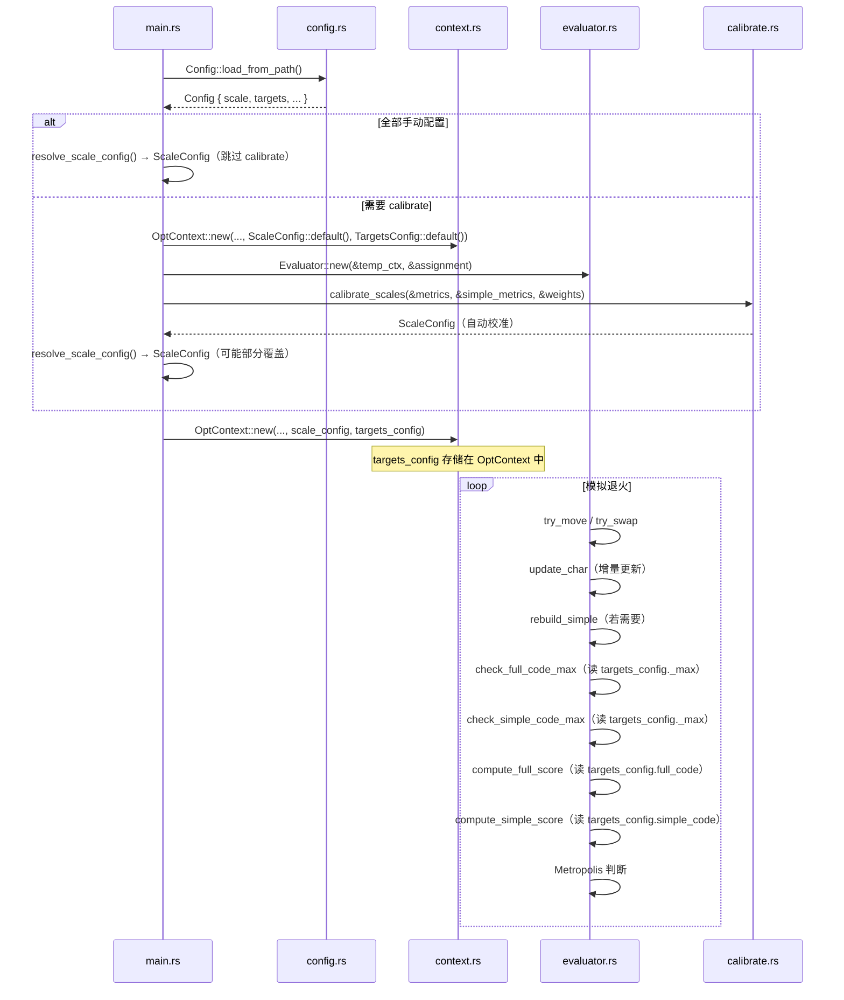

# 技术设计文档：目标偏差优化（target-deviation-optimization）

## Overview

本功能将 CodeGenie 模拟退火优化器的评分机制从"绝对值最小化"改造为"目标偏差导向"。
核心变化包括：

1. **新增 `[scale]` 配置段**：允许用户手动指定量纲缩放因子，全部指定时可跳过 calibrate 阶段。
2. **新增 `[targets]` 配置段**：为全码和简码各指标设置优化目标值及硬约束上限（`_max`）。
3. **修改评分公式**：从线性最小化改为目标偏差平方惩罚 + 低权重线性项。
4. **新增硬约束检查**：在 `try_move`/`try_swap` 热路径中，超出 `_max` 的方案直接拒绝。


---

## Architecture

### 模块依赖关系

```
config.rs          ← 新增 ScaleConfigToml、TargetsConfig、FullCodeTargets、SimpleCodeTargets
    ↓
main.rs            ← run_optimize() 中新增 resolve_scale_config() 逻辑
    ↓
context.rs         ← OptContext 新增 targets_config: TargetsConfig 字段
    ↓
evaluator.rs       ← compute_full_score()、compute_simple_score()、try_move()、try_swap() 修改
```

### 数据流

```
config.toml
  [scale]          → ScaleConfigToml → resolve_scale_config() → ScaleConfig → OptContext
  [targets]        → TargetsConfig                            → OptContext

OptContext {
  scale_config: ScaleConfig,
  targets_config: TargetsConfig,   ← 新增
  ...
}

退火热路径：
  try_move/try_swap
    → update_char (增量更新碰撞/当量)
    → rebuild_simple (若需要)
    → _max 硬约束检查  ← 新增
    → compute_full_score (目标偏差公式)  ← 修改
    → compute_simple_score (目标偏差公式)  ← 修改
    → Metropolis 判断
```


---

## Components and Interfaces

### 各模块详细设计

### 1. `config.rs` — 新增配置结构体

#### 1.1 新增数据结构

```rust
/// TOML 可选 scale 配置（所有字段 Option<f64>，对应 [scale] 段）
#[derive(Debug, Clone, Deserialize, Default)]
pub struct ScaleConfigToml {
    pub collision_count: Option<f64>,
    pub collision_rate: Option<f64>,
    pub equivalence: Option<f64>,
    pub equiv_cv: Option<f64>,
    pub distribution: Option<f64>,
    pub simple_freq: Option<f64>,
    pub simple_equiv: Option<f64>,
    pub simple_dist: Option<f64>,
    pub simple_collision_count: Option<f64>,
    pub simple_collision_rate: Option<f64>,
}

/// 全码目标配置（对应 [targets.full_code] 段）
#[derive(Debug, Clone, Deserialize, Default)]
pub struct FullCodeTargets {
    pub enabled: bool,             // 默认 false
    pub collision_count: f64,      // 默认 0.0
    pub collision_rate: f64,
    pub equivalence: f64,
    pub equiv_cv: f64,
    pub distribution: f64,
    pub low_weight: f64,           // 默认 0.01
    // _max 硬约束（0.0 = 不启用）
    pub collision_count_max: f64,
    pub collision_rate_max: f64,
    pub equivalence_max: f64,
    pub equiv_cv_max: f64,
    pub distribution_max: f64,
}

/// 简码目标配置（对应 [targets.simple_code] 段）
#[derive(Debug, Clone, Deserialize, Default)]
pub struct SimpleCodeTargets {
    pub enabled: bool,             // 默认 false
    pub collision_count: f64,
    pub collision_rate: f64,
    pub freq: f64,                 // 频率覆盖率目标（v_i = 1 - coverage）
    pub equiv: f64,
    pub dist: f64,
    pub low_weight: f64,           // 默认 0.01
    // _max 硬约束（0.0 = 不启用）
    pub collision_count_max: f64,
    pub collision_rate_max: f64,
    pub freq_max: f64,             // 覆盖率下限（coverage < freq_max 时拒绝）
    pub equiv_max: f64,
    pub dist_max: f64,
}

/// 目标配置容器（对应 [targets] 段）
#[derive(Debug, Clone, Deserialize, Default)]
pub struct TargetsConfig {
    pub full_code: FullCodeTargets,
    pub simple_code: SimpleCodeTargets,
}
```


#### 1.2 `Config` 结构体修改

在现有 `Config` 结构体中新增两个可选字段：

```rust
#[derive(Debug, Clone, Deserialize)]
pub struct Config {
    pub files: FilesConfig,
    pub keys: KeysConfig,
    pub weights: WeightsConfig,
    pub annealing: AnnealingConfig,
    pub simple_levels: Vec<SimpleLevelConfig>,
    // 新增：
    pub scale: Option<ScaleConfigToml>,    // 可选，缺失则完全依赖 calibrate
    pub targets: Option<TargetsConfig>,    // 可选，缺失则使用默认（disabled）
}
```

新增辅助方法：

```rust
impl Config {
    /// 获取 TargetsConfig，缺失时返回默认值（全部 disabled）
    pub fn get_targets_config(&self) -> TargetsConfig {
        self.targets.clone().unwrap_or_default()
    }
}
```

#### 1.3 `FullCodeTargets` 和 `SimpleCodeTargets` 的 `Default` 实现

需要为 `low_weight` 设置合理默认值（不能依赖 `#[derive(Default)]` 的 0.0）：

```rust
impl Default for FullCodeTargets {
    fn default() -> Self {
        Self {
            enabled: false,
            collision_count: 0.0,
            collision_rate: 0.0,
            equivalence: 0.0,
            equiv_cv: 0.0,
            distribution: 0.0,
            low_weight: 0.01,   // 全码默认低权重
            collision_count_max: 0.0,
            collision_rate_max: 0.0,
            equivalence_max: 0.0,
            equiv_cv_max: 0.0,
            distribution_max: 0.0,
        }
    }
}

impl Default for SimpleCodeTargets {
    fn default() -> Self {
        Self {
            enabled: false,
            collision_count: 0.0,
            collision_rate: 0.0,
            freq: 0.0,
            equiv: 0.0,
            dist: 0.0,
            low_weight: 0.01,   // 简码默认低权重
            collision_count_max: 0.0,
            collision_rate_max: 0.0,
            freq_max: 0.0,
            equiv_max: 0.0,
            dist_max: 0.0,
        }
    }
}
```


---

### 2. `main.rs` — `run_optimize()` 中的 calibrate 跳过逻辑

#### 2.1 新增辅助函数 `resolve_scale_config`

此函数在 `run_optimize()` 中调用，根据 `cfg.scale` 决定是否跳过 calibrate。

**关键语义：** `[scale]` 中填写的是各指标的"典型值"（与 `targets` 同量纲），函数内部通过 `to_scale = |v| 1.0 / v` 取倒数转换为 `ScaleConfig` 缩放因子。

**跳过 calibrate 的条件：** 全码 5 个字段全部设置，且（`simple_code.enabled = false` 或简码 5 个字段也全部设置）。

```rust
/// 根据配置决定最终使用的 ScaleConfig 及其来源说明
/// [scale] 中填写的是"典型值"，函数内部取倒数转换为缩放因子（scale = 1/典型值）
/// 跳过 calibrate 的条件：全码字段全设置，且（简码未启用 OR 简码字段也全设置）
fn resolve_scale_config(
    cfg: &Config,
    calibrated: ScaleConfig,
) -> (ScaleConfig, &'static str) {
    let simple_enabled = cfg.weights.simple_code.enabled;

    // 辅助闭包：将"典型值"转换为缩放因子（取倒数），0 值保护
    let to_scale = |v: f64| if v > 0.0 { 1.0 / v } else { 1.0 };

    match &cfg.scale {
        None => (calibrated, "自动校准"),
        Some(toml) => {
            // 全码 5 个字段必须全部设置
            let full_code_set = toml.collision_count.is_some()
                && toml.collision_rate.is_some()
                && toml.equivalence.is_some()
                && toml.equiv_cv.is_some()
                && toml.distribution.is_some();

            // 简码字段：仅在 simple_code.enabled = true 时才要求设置
            let simple_code_set = !simple_enabled || (
                toml.simple_freq.is_some()
                    && toml.simple_equiv.is_some()
                    && toml.simple_dist.is_some()
                    && toml.simple_collision_count.is_some()
                    && toml.simple_collision_rate.is_some()
            );

            let all_set = full_code_set && simple_code_set;

            if all_set {
                let sc = ScaleConfig {
                    collision_count:        to_scale(toml.collision_count.unwrap()),
                    collision_rate:         to_scale(toml.collision_rate.unwrap()),
                    equivalence:            to_scale(toml.equivalence.unwrap()),
                    equiv_cv:               to_scale(toml.equiv_cv.unwrap()),
                    distribution:           to_scale(toml.distribution.unwrap()),
                    simple_freq:            toml.simple_freq.map(to_scale).unwrap_or(calibrated.simple_freq),
                    simple_equiv:           toml.simple_equiv.map(to_scale).unwrap_or(calibrated.simple_equiv),
                    simple_dist:            toml.simple_dist.map(to_scale).unwrap_or(calibrated.simple_dist),
                    simple_collision_count: toml.simple_collision_count.map(to_scale).unwrap_or(calibrated.simple_collision_count),
                    simple_collision_rate:  toml.simple_collision_rate.map(to_scale).unwrap_or(calibrated.simple_collision_rate),
                };
                (sc, "手动配置")
            } else {
                // 部分覆盖：以 calibrated 为基础，用手动值（取倒数后）覆盖
                let mut sc = calibrated;
                if let Some(v) = toml.collision_count        { sc.collision_count = to_scale(v); }
                if let Some(v) = toml.collision_rate         { sc.collision_rate = to_scale(v); }
                if let Some(v) = toml.equivalence            { sc.equivalence = to_scale(v); }
                if let Some(v) = toml.equiv_cv               { sc.equiv_cv = to_scale(v); }
                if let Some(v) = toml.distribution           { sc.distribution = to_scale(v); }
                if let Some(v) = toml.simple_freq            { sc.simple_freq = to_scale(v); }
                if let Some(v) = toml.simple_equiv           { sc.simple_equiv = to_scale(v); }
                if let Some(v) = toml.simple_dist            { sc.simple_dist = to_scale(v); }
                if let Some(v) = toml.simple_collision_count { sc.simple_collision_count = to_scale(v); }
                if let Some(v) = toml.simple_collision_rate  { sc.simple_collision_rate = to_scale(v); }
                (sc, "部分手动覆盖")
            }
        }
    }
}
```


#### 2.2 `run_optimize()` 中的修改逻辑

**原有流程（校准阶段）：**

```
temp_ctx = OptContext::new(..., ScaleConfig::default(), ...)
initial_assignment = smart_init(&temp_ctx, cfg)
initial_eval = Evaluator::new(&temp_ctx, &initial_assignment)
initial_metrics = initial_eval.get_metrics(&temp_ctx)
scale_config = calibrate_scales(&initial_metrics, ...)
```

**新流程（支持跳过 calibrate）：**

```rust
// 判断是否需要 calibrate
// 全码 5 个字段必须全部设置；简码字段仅在 simple_code.enabled = true 时才要求
let full_code_scale_set = cfg.scale.as_ref().map_or(false, |s| {
    s.collision_count.is_some()
        && s.collision_rate.is_some()
        && s.equivalence.is_some()
        && s.equiv_cv.is_some()
        && s.distribution.is_some()
});
let simple_code_scale_set = !cfg.weights.simple_code.enabled
    || cfg.scale.as_ref().map_or(false, |s| {
        s.simple_freq.is_some()
            && s.simple_equiv.is_some()
            && s.simple_dist.is_some()
            && s.simple_collision_count.is_some()
            && s.simple_collision_rate.is_some()
    });
let all_manual = full_code_scale_set && simple_code_scale_set;

let (scale_config, scale_source) = if all_manual {
    // 跳过 calibrate，直接使用手动配置
    let (sc, src) = resolve_scale_config(cfg, ScaleConfig::default());
    (sc, src)
} else {
    // 需要 calibrate：构建 temp_ctx，计算初始指标
    let temp_ctx = OptContext::new(
        &splits, &fixed_roots, &dynamic_groups,
        equiv_table, key_dist_config,
        ScaleConfig::default(), simple_config.clone(), weights,
    );
    let initial_assignment = annealing::smart_init(&temp_ctx, cfg);
    let initial_eval = Evaluator::new(&temp_ctx, &initial_assignment);
    let initial_metrics = initial_eval.get_metrics(&temp_ctx);
    let initial_simple_metrics = initial_eval.get_simple_metrics(&temp_ctx);
    let calibrated = calibrate_scales(&initial_metrics, &initial_simple_metrics, &weights);
    resolve_scale_config(cfg, calibrated)
};

println!("  ScaleConfig 来源: {}", scale_source);
// 打印各字段最终值...

// 获取 targets_config
let targets_config = cfg.get_targets_config();

// 构建正式 OptContext（新增 targets_config 参数）
let ctx = OptContext::new(
    &splits, &fixed_roots, &dynamic_groups,
    equiv_table_2, key_dist_config_2,
    scale_config, simple_config, weights,
    targets_config,   // 新增参数
);
```


---

### 3. `context.rs` — `OptContext` 新增字段

#### 3.1 结构体修改

```rust
pub struct OptContext {
    // ... 现有字段（不变）...
    pub scale_config: ScaleConfig,
    pub simple_config: SimpleCodeConfig,
    // 新增：
    pub targets_config: TargetsConfig,
}
```

#### 3.2 `OptContext::new()` 签名修改

新增最后一个参数 `targets_config: TargetsConfig`：

```rust
pub fn new(
    splits: &[(char, Vec<String>, u64)],
    fixed_roots: &HashMap<String, u8>,
    groups: &[RootGroup],
    equiv_table: EquivTable,
    key_dist_config: [KeyDistConfig; EQUIV_TABLE_SIZE],
    scale_config: ScaleConfig,
    simple_config: SimpleCodeConfig,
    weights: WeightConfig,
    targets_config: TargetsConfig,   // 新增
) -> Self {
    // ... 现有初始化逻辑（不变）...
    Self {
        // ... 现有字段 ...
        targets_config,   // 新增
    }
}
```

**注意**：`evaluate` 子命令中调用 `OptContext::new()` 时，需传入 `TargetsConfig::default()`（全部 disabled），保持向后兼容。


---

### 4. `evaluator.rs` — 评分公式修改

#### 4.1 目标偏差公式

新的评分公式（`enabled = true` 时）：

```
d = max(0, v_i - target_i) * scale_i
score_i = w_i * (d + d^2 + low_weight * (v_i * scale_i))
```

其中：
- `v_i`：当前指标值
- `target_i`：目标值（来自 `TargetsConfig`）
- `scale_i`：量纲缩放因子（来自 `ScaleConfig`，由 calibrate 计算为 `1/初始值`）
- `w_i`：权重（来自 `WeightConfig`）
- `low_weight`：低权重系数（全码和简码默认均为 0.01）

原始公式（`enabled = false` 时，保持不变）：

```
score_i = w_i * v_i * scale_i
```

#### 4.2 `compute_full_score` 修改

```rust
#[inline(always)]
pub fn compute_full_score(&self, ctx: &OptContext) -> f64 {
    if ctx.targets_config.full_code.enabled {
        let t = &ctx.targets_config.full_code;
        let lw = t.low_weight;
        let mut score = 0.0;

        // collision_count
        {
            let v = self.total_collisions as f64;
            let s = ctx.scale_config.collision_count;
            let d = (v - t.collision_count).max(0.0) * s;
            score += ctx.weights.weight_collision_count
                * (d + d * d + lw * (v * s));
        }

        // collision_rate
        if ctx.weights.weight_collision_rate > 0.0 {
            let v = self.collision_frequency as f64 * self.inv_total_frequency;
            let s = ctx.scale_config.collision_rate;
            let d = (v - t.collision_rate).max(0.0) * s;
            score += ctx.weights.weight_collision_rate
                * (d + d * d + lw * (v * s));
        }

        // equivalence (equiv_mean)
        if ctx.weights.weight_equivalence > 0.0 {
            let v = self.total_equiv_weighted * self.inv_total_frequency;
            let s = ctx.scale_config.equivalence;
            let d = (v - t.equivalence).max(0.0) * s;
            score += ctx.weights.weight_equivalence
                * (d + d * d + lw * (v * s));
        }

        // equiv_cv
        if ctx.weights.weight_equiv_cv > 0.0 {
            let v = self.calc_equiv_cv();
            let s = ctx.scale_config.equiv_cv;
            let d = (v - t.equiv_cv).max(0.0) * s;
            score += ctx.weights.weight_equiv_cv
                * (d + d * d + lw * (v * s));
        }

        // distribution
        if ctx.weights.weight_distribution > 0.0 {
            let v = self.calc_distribution_deviation(&ctx.key_dist_config);
            let s = ctx.scale_config.distribution;
            let d = (v - t.distribution).max(0.0) * s;
            score += ctx.weights.weight_distribution
                * (d + d * d + lw * (v * s));
        }

        score
    } else {
        // 原有绝对值最小化模式（保持不变）
        let mut score = ctx.weights.weight_collision_count
            * self.total_collisions as f64
            * ctx.scale_config.collision_count;
        // ... 其余原有逻辑 ...
        score
    }
}
```


#### 4.3 `SimpleEvaluator::compute_simple_score` 修改

简码频率覆盖率的特殊处理：`v_i = 1 - coverage`（损失值），`target_i = 1 - t.freq`。

```rust
fn compute_simple_score(&self, ctx: &OptContext) -> f64 {
    let sm = self.get_simple_metrics(ctx);

    if ctx.targets_config.simple_code.enabled {
        let t = &ctx.targets_config.simple_code;
        let lw = t.low_weight;
        let mut score = 0.0;

        // freq（频率覆盖损失 = 1 - coverage）
        {
            let v = 1.0 - sm.weighted_freq_coverage;
            let target_v = 1.0 - t.freq;   // 目标损失 = 1 - 目标覆盖率
            let s = ctx.scale_config.simple_freq;
            let d = (v - target_v).max(0.0) * s;
            score += ctx.weights.simple_weight_freq
                * (d + d * d + lw * (v * s));
        }

        // equiv
        {
            let v = sm.equiv_mean;
            let s = ctx.scale_config.simple_equiv;
            let d = (v - t.equiv).max(0.0) * s;
            score += ctx.weights.simple_weight_equiv
                * (d + d * d + lw * (v * s));
        }

        // dist
        {
            let v = sm.dist_deviation;
            let s = ctx.scale_config.simple_dist;
            let d = (v - t.dist).max(0.0) * s;
            score += ctx.weights.simple_weight_dist
                * (d + d * d + lw * (v * s));
        }

        // collision_count
        {
            let v = sm.collision_count as f64;
            let s = ctx.scale_config.simple_collision_count;
            let d = (v - t.collision_count).max(0.0) * s;
            score += ctx.weights.simple_weight_collision_count
                * (d + d * d + lw * (v * s));
        }

        // collision_rate
        {
            let v = sm.collision_rate;
            let s = ctx.scale_config.simple_collision_rate;
            let d = (v - t.collision_rate).max(0.0) * s;
            score += ctx.weights.simple_weight_collision_rate
                * (d + d * d + lw * (v * s));
        }

        score
    } else {
        // 原有绝对值最小化模式（保持不变）
        let freq_loss = (1.0 - sm.weighted_freq_coverage) * ctx.scale_config.simple_freq;
        let equiv_loss = sm.equiv_mean * ctx.scale_config.simple_equiv;
        let dist_loss = sm.dist_deviation * ctx.scale_config.simple_dist;
        let collision_count_loss =
            sm.collision_count as f64 * ctx.scale_config.simple_collision_count;
        let collision_rate_loss = sm.collision_rate * ctx.scale_config.simple_collision_rate;

        ctx.weights.simple_weight_freq * freq_loss
            + ctx.weights.simple_weight_equiv * equiv_loss
            + ctx.weights.simple_weight_dist * dist_loss
            + ctx.weights.simple_weight_collision_count * collision_count_loss
            + ctx.weights.simple_weight_collision_rate * collision_rate_loss
    }
}
```


---

### 5. `evaluator.rs` — `_max` 硬约束检查

#### 5.1 检查时序

在 `try_move` 和 `try_swap` 中，硬约束检查插入在方案变动之后、得分计算之前：

```
1. 保存旧状态（old_key, old_score）
2. 执行方案变动（assignment 修改 + update_char）
3. 若 needs_simple：rebuild_simple
4. ← 新增：_max 硬约束检查
5. 计算新得分
6. Metropolis 判断
7. 若拒绝：回滚
```

#### 5.2 全码 `_max` 检查辅助宏/内联函数

为避免代码重复，在 `try_move` 和 `try_swap` 中共用同一段检查逻辑：

```rust
/// 执行全码 _max 硬约束检查
/// 返回 true 表示通过（未超限），false 表示超限需回滚
#[inline(always)]
fn check_full_code_max(&self, ctx: &OptContext) -> bool {
    let t = &ctx.targets_config.full_code;

    if t.collision_count_max > 0.0
        && self.total_collisions as f64 > t.collision_count_max
    {
        return false;
    }

    if t.collision_rate_max > 0.0 {
        let rate = self.collision_frequency as f64 * self.inv_total_frequency;
        if rate > t.collision_rate_max {
            return false;
        }
    }

    if t.equivalence_max > 0.0 {
        let equiv = self.total_equiv_weighted * self.inv_total_frequency;
        if equiv > t.equivalence_max {
            return false;
        }
    }

    if t.equiv_cv_max > 0.0 {
        let cv = self.calc_equiv_cv();
        if cv > t.equiv_cv_max {
            return false;
        }
    }

    if t.distribution_max > 0.0 {
        let dist = self.calc_distribution_deviation(&ctx.key_dist_config);
        if dist > t.distribution_max {
            return false;
        }
    }

    true
}

/// 执行简码 _max 硬约束检查
/// 返回 true 表示通过（未超限），false 表示超限需回滚
#[inline(always)]
fn check_simple_code_max(&self, ctx: &OptContext) -> bool {
    let t = &ctx.targets_config.simple_code;
    if let Some(ref se) = self.simple_eval {
        let sm = se.get_simple_metrics(ctx);

        if t.collision_count_max > 0.0
            && sm.collision_count as f64 > t.collision_count_max
        {
            return false;
        }
        if t.collision_rate_max > 0.0 && sm.collision_rate > t.collision_rate_max {
            return false;
        }
        if t.freq_max > 0.0 && sm.weighted_freq_coverage < t.freq_max {
            return false;
        }
        if t.equiv_max > 0.0 && sm.equiv_mean > t.equiv_max {
            return false;
        }
        if t.dist_max > 0.0 && sm.dist_deviation > t.dist_max {
            return false;
        }
    }
    true
}
```


#### 5.3 `try_move` 修改后的完整逻辑（伪代码）

```rust
pub fn try_move(
    &mut self,
    ctx: &OptContext,
    assignment: &mut [u8],
    r: usize,
    new_key: u8,
    temp: f64,
    rng: &mut ThreadRng,
) -> bool {
    let old_key = assignment[r];
    if old_key == new_key { return false; }

    let old_score = self.get_score(ctx);
    let needs_simple = self.has_simple_impact(ctx, r);

    // 1. 执行方案变动
    let gfs = ctx.group_freq_sum[r];
    self.key_weighted_usage[old_key as usize] -= gfs;
    self.key_weighted_usage[new_key as usize] += gfs;
    assignment[r] = new_key;
    for &ci in &ctx.group_to_chars[r] {
        self.update_char(ctx, assignment, ci);
    }

    // 2. 若需要，重建简码
    if needs_simple {
        self.rebuild_simple(ctx, assignment);
    }

    // 3. _max 硬约束检查（新增）
    if !self.check_full_code_max(ctx) {
        // 回滚
        self.key_weighted_usage[new_key as usize] -= gfs;
        self.key_weighted_usage[old_key as usize] += gfs;
        assignment[r] = old_key;
        for &ci in &ctx.group_to_chars[r] { self.update_char(ctx, assignment, ci); }
        if needs_simple { self.rebuild_simple(ctx, assignment); }
        self.cached_score = old_score;
        self.score_dirty = false;
        return false;
    }
    if ctx.enable_simple_code && needs_simple && !self.check_simple_code_max(ctx) {
        // 回滚（同上）
        // ...
        return false;
    }

    // 4. 计算新得分，Metropolis 判断
    self.score_dirty = true;
    let new_score = self.get_score(ctx);
    let delta = new_score - old_score;

    if delta <= 0.0 || rng.gen::<f64>() < (-delta / temp).exp() {
        true
    } else {
        // 回滚（同上）
        // ...
        false
    }
}
```

`try_swap` 的修改逻辑与 `try_move` 完全对称，此处不再重复。


---

### 6. `config.toml.example` 新增配置段

在现有示例文件末尾追加以下内容。`[scale]` 段保持注释（缺失时自动 calibrate 是推荐行为）；`[targets.full_code]` 和 `[targets.simple_code]` 段**不注释**，以 `enabled = false` 的默认状态出现，让用户开箱即用、按需修改。

```toml
# -------------------------------------------------------------------------
# 📐 量纲缩放配置（可选，缺失则自动校准）
# 填写各指标的"典型值"（与 targets 中的指标同量纲），程序内部自动取倒数转为缩放因子
# 全码 5 个字段均设置时（简码未启用则无需设置简码字段），跳过 calibrate 阶段
# -------------------------------------------------------------------------
# [scale]
# collision_count = 100.0    # 典型重码数（如初始状态约 100 个重码）
# collision_rate = 0.05      # 典型重码率（如 5%）
# equivalence = 1.5          # 典型当量
# equiv_cv = 0.3             # 典型当量变异系数
# distribution = 5.0         # 典型分布偏差
# simple_freq = 0.15         # 典型简码频率覆盖损失（= 1 - 覆盖率，如覆盖 85% 则填 0.15）
# simple_equiv = 1.3         # 典型简码当量
# simple_dist = 3.0          # 典型简码分布偏差
# simple_collision_count = 20.0  # 典型简码重码数
# simple_collision_rate = 0.02   # 典型简码重码率

# -------------------------------------------------------------------------
# 🎯 优化目标配置
# enabled = false 时退回绝对值最小化模式（默认行为）
# enabled = true 时启用目标偏差导向优化
# -------------------------------------------------------------------------
[targets.full_code]
enabled = false              # 是否启用全码目标偏差模式
collision_count = 0.0        # 目标重码数（0 = 不设目标，退化为纯 low_weight 惩罚）
collision_rate = 0.0         # 目标重码率
equivalence = 0.0            # 目标当量
equiv_cv = 0.0               # 目标当量变异系数
distribution = 0.0           # 目标分布偏差
low_weight = 0.01            # 低权重系数（已达目标时的持续优化动力）
collision_count_max = 0.0    # 硬约束：重码数超过此值直接拒绝（0 = 不启用）
collision_rate_max = 0.0     # 硬约束：重码率超过此值直接拒绝（0 = 不启用）
equivalence_max = 0.0        # 硬约束：当量超过此值直接拒绝（0 = 不启用）
equiv_cv_max = 0.0           # 硬约束：当量变异系数超过此值直接拒绝（0 = 不启用）
distribution_max = 0.0       # 硬约束：分布偏差超过此值直接拒绝（0 = 不启用）

[targets.simple_code]
enabled = false              # 是否启用简码目标偏差模式
collision_count = 0.0        # 目标简码重码数
collision_rate = 0.0         # 目标简码重码率
freq = 0.0                   # 目标频率覆盖率（如 0.85 = 85%）
equiv = 0.0                  # 目标简码当量
dist = 0.0                   # 目标简码分布偏差
low_weight = 0.01            # 低权重系数
collision_count_max = 0.0    # 硬约束：简码重码数超过此值直接拒绝（0 = 不启用）
collision_rate_max = 0.0     # 硬约束：简码重码率超过此值直接拒绝（0 = 不启用）
freq_max = 0.0               # 硬约束：覆盖率低于此值直接拒绝（0 = 不启用）
equiv_max = 0.0              # 硬约束：简码当量超过此值直接拒绝（0 = 不启用）
dist_max = 0.0               # 硬约束：简码分布偏差超过此值直接拒绝（0 = 不启用）
```


---

## 关键算法：目标偏差公式推导

### 公式语义

设某指标当前值为 `v`，目标值为 `target`，量纲缩放因子为 `s = 1/初始值`，权重为 `w`，低权重系数为 `lw`：

```
d = max(0, v - target) * s
score = w * (d + d^2 + lw * (v * s))
```

**分段行为：**

| 条件 | d 值 | 超标惩罚项 `d + d^2` | 低权重项 | 合计 |
|------|------|---------------------|---------|------|
| `v <= target`（已达目标） | 0 | 0 | `w * lw * v * s` | 微弱线性惩罚 |
| `v > target`，`d < 1`（微小超标） | 小 | `d + d^2 ≈ d`（线性主导） | `w * lw * v * s` | 线性惩罚为主 |
| `v > target`，`d > 1`（大幅超标） | 大 | `d + d^2 ≈ d^2`（平方主导） | `w * lw * v * s` | 平方惩罚为主 |

**设计动机：**

纯平方公式 `d^2` 在 `d < 1` 时惩罚过小（如 `d=0.1` 时 `d^2=0.01`），可能弱于 `low_weight` 项，导致微小超标得不到足够惩罚。加入线性项 `d` 后，微小超标时惩罚至少为 `d`，始终强于 `low_weight` 项（只要 `lw < 1`）。

**与原始公式的对比：**

```
原始：score = w * v * s                    （线性，无目标）
新版：score = w * (d + d^2 + lw * (v * s))  （线性+平方惩罚超出部分，线性惩罚全量）
```

当 `enabled = false` 时，完全使用原始公式，保证向后兼容。

### 量纲归一化

`scale_i = 1/初始值_i` 由 `calibrate_scales()` 计算，使得：

```
v_i * scale_i ≈ 1.0  （初始状态下各指标归一化后约为 1）
(v_i - target_i) * scale_i  （超出目标的部分，以初始值为单位）
```

这保证了不同量纲的指标（如重码数 ~100 vs 重码率 ~0.01）在得分中具有可比性。

---

## 模块间交互关系




---

## Data Models

### 新增类型关系

```
Config
├── scale: Option<ScaleConfigToml>     ← TOML 解析用（10个 Option<f64>）
└── targets: Option<TargetsConfig>
    ├── full_code: FullCodeTargets
    │   ├── enabled: bool
    │   ├── collision_count/rate/equivalence/equiv_cv/distribution: f64（目标值）
    │   ├── low_weight: f64
    │   └── *_max: f64（硬约束，0=不启用）
    └── simple_code: SimpleCodeTargets
        ├── enabled: bool
        ├── collision_count/rate/freq/equiv/dist: f64（目标值）
        ├── low_weight: f64
        └── *_max: f64（硬约束，0=不启用）

OptContext
├── scale_config: ScaleConfig          ← 运行时使用（10个 f64，已解析）
└── targets_config: TargetsConfig      ← 新增，运行时使用
```

### `ScaleConfigToml` vs `ScaleConfig` 的区别

| 类型 | 用途 | 字段类型 | 来源 |
|------|------|---------|------|
| `ScaleConfigToml` | TOML 解析 | `Option<f64>` | `config.rs` |
| `ScaleConfig` | 运行时计算 | `f64` | `types.rs`，由 calibrate 或手动配置生成 |

`resolve_scale_config()` 负责将 `ScaleConfigToml` 转换为 `ScaleConfig`。

---

## Error Handling

### 配置解析错误

- TOML 解析失败时，`Config::load_from_path()` 已有 `eprintln!` 提示并使用默认配置。
- 新增字段均为 `Option` 或有 `Default`，不会导致现有配置文件解析失败（向后兼容）。
- `FullCodeTargets` 和 `SimpleCodeTargets` 中的 `f64` 字段若格式错误，TOML 解析器会给出字段名和行号。

### 运行时边界情况

| 情况 | 处理方式 |
|------|---------|
| `scale_i = 0.0`（初始值为 0） | `calibrate_scales()` 已用 `eps = 1e-9` 防止除零 |
| `target_i < 0.0` | `max(0, v - target)` 仍正确工作（excess 更大） |
| `low_weight = 0.0` | 低权重项为 0，退化为纯平方惩罚 |
| 所有 `_max = 0.0` | 硬约束检查分支被编译器优化，无运行时开销 |
| `enabled = false` | 完全使用原始公式，行为与修改前完全一致 |


---

## Correctness Properties

*属性（Property）是在系统所有合法执行中都应成立的特征或行为——本质上是对系统应做什么的形式化陈述。属性是人类可读规范与机器可验证正确性保证之间的桥梁。*

### 属性反思（去冗余）

在写出最终属性之前，先对 prework 中识别的可测试项进行反思：

- **1.3（全部手动配置）** 和 **1.4（部分覆盖）** 可合并为一个更通用的属性：对任意 `ScaleConfigToml`，`resolve_scale_config` 的结果中，`Some` 字段等于手动值，`None` 字段等于 calibrated 值（全部 `Some` 时是其特例）。
- **4.1（目标偏差公式）** 覆盖了 **4.4（v<=target 时只有 low_weight 项）** 和 **4.5（v>target 时两项之和）**，后两者是前者的特例，合并为一个属性。
- **4.2（disabled 时向后兼容）** 和 **5.2（简码 disabled 时向后兼容）** 是对称的，各保留一个。
- **5.1（简码目标偏差公式）** 和 **4.1（全码目标偏差公式）** 结构相同，各保留一个。
- **5.4（频率覆盖损失方向）** 是 **5.1** 的重要特例，单独保留以确保覆盖率方向不被搞反。
- **6.1/6.2/6.3（_max 硬约束）** 可合并为一个属性：超出任意非零 _max 的方案必须被拒绝。
- **3.3（_max=0 时不拒绝）** 与 **6.1/6.2/6.3** 互补，保留为独立属性。

最终保留 7 个属性。

---

### Property 1: `resolve_scale_config` 的覆盖语义

*对任意* `ScaleConfigToml`（字段可为 `Some` 或 `None`）和任意 calibrated `ScaleConfig`，
`resolve_scale_config` 的返回值中：
- 若某字段在 `ScaleConfigToml` 中为 `Some(v)`，则返回值中该字段等于 `v`；
- 若某字段在 `ScaleConfigToml` 中为 `None`，则返回值中该字段等于 calibrated 值。

**Validates: Requirements 1.3, 1.4**

---

### Property 2: 全码目标偏差公式正确性

*对任意* 非负的 `v_i`、`target_i`、`scale_i`、`w_i`、`low_weight`，
当 `full_code.enabled = true` 时，`compute_full_score` 中每个指标的得分分量应等于：

```
w_i * ((max(0, v_i - target_i) * scale_i)^2 + low_weight * (v_i * scale_i))
```

特别地，当 `v_i <= target_i` 时，超出惩罚项为 0，得分仅为 `w_i * low_weight * v_i * scale_i`。

**Validates: Requirements 4.1, 4.4, 4.5**

---

### Property 3: 全码 `enabled=false` 时向后兼容

*对任意* 编码方案，当 `full_code.enabled = false` 时，`compute_full_score` 的结果应与原始线性公式完全一致：

```
score = Σ w_i * v_i * scale_i
```

**Validates: Requirements 4.2**

---

### Property 4: 简码目标偏差公式正确性（含频率覆盖损失方向）

*对任意* 简码指标值，当 `simple_code.enabled = true` 时，`compute_simple_score` 中：
- 频率覆盖指标以 `v = 1 - weighted_freq_coverage` 作为当前值，以 `1 - t.freq` 作为目标值；
- 其余指标（equiv、dist、collision_count、collision_rate）直接使用原始值；
- 每个指标的得分分量等于目标偏差公式计算值。

**Validates: Requirements 5.1, 5.4**

---

### Property 5: 简码 `enabled=false` 时向后兼容

*对任意* 简码方案，当 `simple_code.enabled = false` 时，`compute_simple_score` 的结果应与原始线性公式完全一致。

**Validates: Requirements 5.2**

---

### Property 6: 非零 `_max` 约束必须拒绝超限方案

*对任意* 编码方案变动，若变动后某指标值超过对应的非零 `_max`（全码或简码），
则 `try_move`/`try_swap` 必须返回 `false`，且 `assignment` 恢复为变动前的值。

**Validates: Requirements 6.1, 6.2, 6.3**

---

### Property 7: 所有 `_max = 0.0` 时不因硬约束拒绝方案

*对任意* 编码方案变动，当 `TargetsConfig` 中所有 `_max` 字段均为 `0.0` 时，
`try_move`/`try_swap` 不应因 `_max` 检查而返回 `false`（即硬约束检查对结果无影响）。

**Validates: Requirements 3.3**


---

## Testing Strategy

### 单元测试（example-based）

| 测试 | 验证内容 |
|------|---------|
| `test_scale_config_toml_parse` | 含 `[scale]` 段的 TOML 正确解析为 `ScaleConfigToml` |
| `test_scale_config_missing` | 缺失 `[scale]` 段时 `cfg.scale` 为 `None` |
| `test_targets_full_code_parse` | `[targets.full_code]` 各字段正确解析 |
| `test_targets_simple_code_parse` | `[targets.simple_code]` 各字段正确解析 |
| `test_targets_defaults` | 未配置字段默认为 0.0，`low_weight` 默认为 0.01 |
| `test_simple_code_disabled_skips_max` | `enable_simple_code=false` 时简码 `_max` 不生效 |

### 属性测试（property-based）

使用 [`proptest`](https://github.com/proptest-rs/proptest) 库，每个属性测试运行至少 100 次。

```toml
# Cargo.toml
[dev-dependencies]
proptest = "1"
```

每个属性测试用注释标注对应的设计属性：

```rust
// Feature: target-deviation-optimization, Property 1: resolve_scale_config 覆盖语义
proptest! {
    #[test]
    fn prop_resolve_scale_config_override_semantics(
        calibrated in arb_scale_config(),
        toml in arb_scale_config_toml(),
    ) {
        let cfg = Config { scale: Some(toml.clone()), ..Config::default() };
        let (result, _) = resolve_scale_config(&cfg, calibrated);
        // Some 字段等于手动值，None 字段等于 calibrated 值
        if let Some(v) = toml.collision_count {
            prop_assert_eq!(result.collision_count, v);
        } else {
            prop_assert_eq!(result.collision_count, calibrated.collision_count);
        }
        // ... 其余字段类似 ...
    }
}
```

```rust
// Feature: target-deviation-optimization, Property 2: 全码目标偏差公式正确性
proptest! {
    #[test]
    fn prop_full_score_target_deviation_formula(
        v in 0.0f64..1000.0,
        target in 0.0f64..1000.0,
        scale in 0.001f64..100.0,
        weight in 0.0f64..1.0,
        low_weight in 0.0f64..1.0,
    ) {
        let d = (v - target).max(0.0) * scale;
        let expected = weight * (d + d * d + low_weight * (v * scale));
        // 构造只有一个指标的 mock 场景，验证 compute_full_score 的分量
        // ...
        prop_assert!((actual - expected).abs() < 1e-9);
    }
}
```

```rust
// Feature: target-deviation-optimization, Property 6: 非零 _max 约束必须拒绝超限方案
proptest! {
    #[test]
    fn prop_max_constraint_rejects_violations(/* ... */) {
        // 构造一个使 total_collisions 超过 collision_count_max 的场景
        // 验证 try_move 返回 false 且 assignment 不变
    }
}
```

### 集成测试

- 使用 `moling/` 目录下的真实数据，运行完整优化流程（少量步数），验证：
  - `enabled=true` 时最终得分低于 `enabled=false` 时（目标偏差模式有效）
  - 设置 `_max` 后最终结果满足硬约束
  - 手动配置 `[scale]` 与自动校准结果在合理范围内一致

